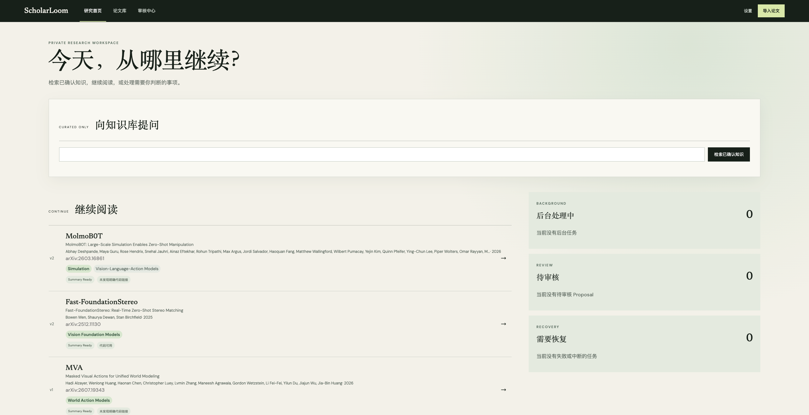
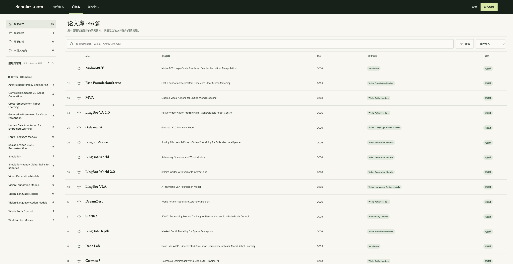
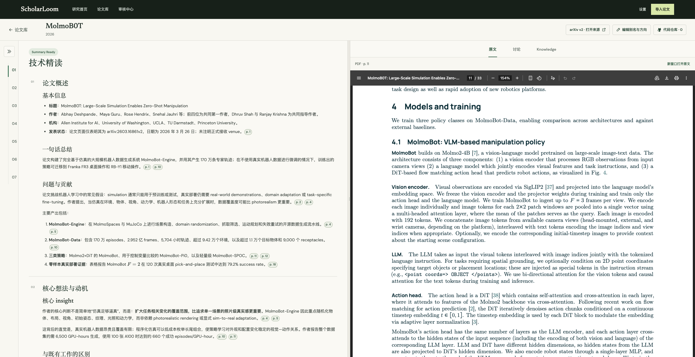
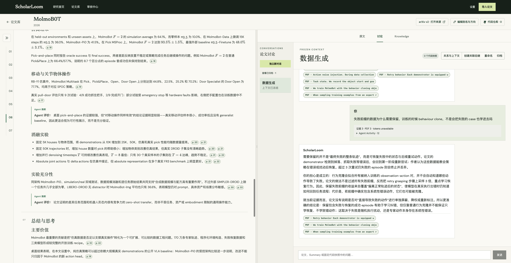

# ScholarLoom

[](LICENSE)
[](package.json)

一个面向个人研究工作的 AI-native 论文阅读与知识沉淀系统。

ScholarLoom 把论文导入、证据化阅读、持续讨论和长期知识组织连接成一个可追溯的闭环。它不仅保存聊天记录，还把经过确认的研究认识沉淀为可检索、可版本化的个人知识。

> ScholarLoom 仍处于早期开发阶段，当前面向单用户、本地优先的研究工作流。数据格式、界面和 Agent 行为仍可能调整。



## 为什么是 ScholarLoom

论文研究往往分散在 PDF 阅读器、聊天工具、GitHub 和笔记软件中。摘要与讨论难以核验，高价值结论停留在聊天历史里，随着材料增长，研究者也越来越依赖自己的短期记忆。

ScholarLoom 的目标是让每个结论都能回到证据，让一次阅读产生的认识可以被后续检索、比较和修正。

## 核心能力

- **论文导入**：支持 arXiv 链接和公开 HTTPS PDF 直链，保留原始 PDF 与版本信息。
- **证据化 Summary**：生成结构化论文精读，并把重要陈述连接到原文页码、章节或图表。
- **原文对照阅读**：在 Paper Workspace 中浏览 Summary、PDF 和证据定位。
- **持续讨论**：保存 Conversation、上下文快照、Agent attempt、引用和失败后的显式重试。
- **可信引用**：回答引用经过路径、内容哈希、行号或 PDF 页面校验的冻结证据。
- **知识沉淀**：从讨论中提出 Takeaway，由用户确认后写入长期知识，而不是静默污染知识库。
- **论文组织**：按 Domain、Research Direction、Topic 和 Alias 组织论文并维护可审查的目录。
- **代码关联**：手动关联 GitHub 仓库并固定 commit；系统不会自动执行论文代码。

## 界面预览

### 论文库与研究方向

论文库集中展示 Alias、原始标题、年份、研究方向和处理状态，并支持搜索、筛选、星标与按 Domain 浏览。



### Summary 与原文对照

Paper Workspace 把结构化 Summary、Evidence Anchor 和固定版本 PDF 放在同一阅读界面中，便于从技术结论直接回到原文核验。



### 冻结上下文与证据化讨论

每个 Conversation 冻结创建时的论文、Summary 与代码快照。回答展示经过校验的 Evidence Receipt，并可提出需要用户确认的 Takeaway。



以上截图来自当前本地部署，界面可能随项目演进而调整。

## 工作方式

```text
arXiv / public PDF / GitHub repository
                  │
                  ▼
       immutable source artifacts
                  │
                  ▼
 Summary → Discussion → confirmed Takeaway
                  │
                  ▼
     Markdown vault + rebuildable indexes
```

ScholarLoom 按职责划分本地数据：

| 位置 | 职责 |
| --- | --- |
| `vault/` | Markdown/YAML 长期知识事实源 |
| `originals/` | 不可变、按内容寻址的论文原文件与历史 Artifact |
| `state/scholarloom.sqlite3` | 任务、关系、队列与检索等运行状态 |
| `derived/`、`cache/` | 可从权威数据重建的派生产物 |

生产数据位于代码仓库之外。默认数据根是 `$HOME/ScholarLoomData`，ScholarLoom 运行时不会把真实论文、个人知识、对话或运行状态写入代码仓库。

## 快速开始

### 环境要求

- Node.js 22 或更高版本
- Git
- 已安装并登录的 [Codex CLI](https://github.com/openai/codex)

### 安装与启动

```bash
git clone https://github.com/FreemanHsu/ScholarLoom.git
cd ScholarLoom
npm install
npm run data:init
npm run migrate
npm start
```

打开 [http://127.0.0.1:3000](http://127.0.0.1:3000)，提交 arXiv 链接或公开 HTTPS PDF 直链即可开始。

`npm run data:init` 默认创建 `$HOME/ScholarLoomData`。该命令拒绝复用已有路径；正常启动也不会静默创建、替换或回退到仓库内的数据目录。

使用其他数据根时，先显式初始化，再使用相同环境变量启动：

```bash
npm run data:init -- /path/to/new-data-root
SCHOLARLOOM_DATA_ROOT=/path/to/new-data-root npm run migrate
SCHOLARLOOM_DATA_ROOT=/path/to/new-data-root npm start
```

## 当前范围

当前版本聚焦“单篇论文深度阅读闭环”：导入论文、生成 Summary、核验原文、围绕冻结证据讨论、确认 Takeaway，并将结果纳入知识检索。

以下内容不在当前支持范围内：登录态或付费墙论文、本地文件上传、执行论文代码、完整学术搜索引擎，以及把未经确认的模型输出直接视为长期知识。

ScholarLoom 是本地优先应用，但不是完全离线应用。论文、代码、对话和知识片段可能作为任务上下文发送给 Codex 使用的云端模型，请只导入你有权处理并允许发送的材料。

## 配置与访问

| 环境变量 | 默认值 | 用途 |
| --- | --- | --- |
| `SCHOLARLOOM_DATA_ROOT` | `$HOME/ScholarLoomData` | 选择已初始化的数据根 |
| `SCHOLARLOOM_HOST` | `127.0.0.1` | 监听地址，仅接受 `127.0.0.1` 或 `::1` |
| `SCHOLARLOOM_PORT` | `3000` | 本地服务端口 |
| `SCHOLARLOOM_PDF_PROXY` | 未设置 | 无凭据的 loopback HTTP CONNECT proxy |
| `SCHOLARLOOM_PDF_OPTIMIZATION` | 未设置 | 设为 `lossless-linearization` 启用可选 PDF 优化 |
| `SCHOLARLOOM_FIXTURE` | `0` | 设为 `1` 运行不访问 arXiv 或 Codex 的开发 fixture |

PDF 下载默认 direct-first。`SCHOLARLOOM_PDF_PROXY` 只接受无凭据的 loopback HTTP proxy；未显式设置时，应用也可以继承满足相同安全约束的 `ALL_PROXY` 或 `all_proxy`。

可选 PDF 优化需要预先安装 `qpdf`。原始文件始终保留在 `originals/`，优化失败时继续交付原文件，派生产物可以随时重建。

### Tailnet 内访问

应用只监听 loopback。需要从其他授权设备访问时，可在运行 ScholarLoom 的主机上使用 Tailscale Serve：

```bash
tailscale serve --bg http://127.0.0.1:3000
tailscale serve status
```

不要使用 Tailscale Funnel，也不要把应用绑定到 `0.0.0.0`、普通 LAN 或 Tailscale interface 地址。

## 数据备份与恢复

创建快照前先停止 ScholarLoom：

```bash
npm run backup -- /path/to/new-snapshot
npm run backup:verify -- /path/to/new-snapshot
npm run restore -- /path/to/new-snapshot /path/to/new-empty-data-root
```

默认快照包含 `vault/`、`originals/`、SQLite Online Backup 和 SHA-256 manifest，不包含可重建的 `derived/`、`cache/`、`logs/` 与 `tmp/`。恢复操作永不覆盖现有数据根。

ScholarLoom 当前不负责自动调度或远端传输。请将已验证的快照交给你选择的备份系统保存。

## 开发与验证

开发模式需要分别启动 Fastify 和 Vite：

```bash
npm run dev:server
npm run dev
```

`dev:server` 使用隔离的 fixture 数据，不访问 arXiv 或 Codex。提交变更前运行：

```bash
npm test
npm run typecheck
npm run build
git diff --check
```

涉及 PDF 浏览器行为时，额外运行：

```bash
npm run test:browser:pdf
```

常用只读诊断与索引维护命令：

```bash
npm run diagnostics
npm run rebuild-index
```

如果诊断报告数据目录不可写，请先停止服务，再运行 `npm run data:repair-permissions`。该命令不会删除或重写知识内容。

## 项目结构

```text
src/        TypeScript 应用、服务端和浏览器 UI
test/       Vitest 集成测试
docs/       产品、架构、数据模型、ADR 和支持性证据
templates/  Markdown 知识产物模板
skills/     应用自带、版本化的 Agent skills
```

文档入口：

- [产品需求](docs/PRD.md)
- [系统架构](docs/architecture.md)
- [数据模型](docs/data-model.md)
- [前端信息架构](docs/frontend-information-architecture.md)
- [架构决策记录](docs/adr/)
- [完整文档索引](docs/README.md)
- [领域术语](CONTEXT.md)

## 贡献与反馈

欢迎通过 [GitHub Issues](https://github.com/FreemanHsu/ScholarLoom/issues) 报告可复现的问题、提出功能建议或讨论设计。提交代码前请先阅读[开发工作流](docs/development-workflow.md)，并确保测试、类型检查和构建全部通过。

提交问题时请勿附带真实论文全文、个人 vault、对话内容、凭据或其他敏感数据。

## License

ScholarLoom 基于 [MIT License](LICENSE) 开源。
