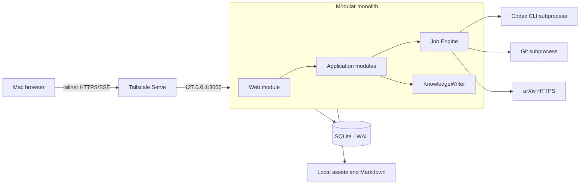
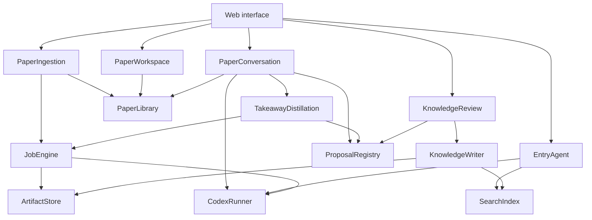

# ScholarLoom v1 System Architecture

- Status: Accepted for implementation
- Date: 2026-07-19
- Product contract: [`PRD.md`](PRD.md)
- Data contract: [`data-model.md`](data-model.md)
- SQLite design: [`sqlite-schema.sql`](sqlite-schema.sql)
- First slice: [`implementation-slice-001.md`](implementation-slice-001.md)

## 1. Architectural outcome

ScholarLoom v1 is a local-first modular monolith written in TypeScript and running
as one long-lived Node.js process on the Mac mini. It serves the browser UI, owns the
SQLite connection pool and KnowledgeWriter, schedules durable jobs, and launches
bounded subprocesses for Codex CLI and Git.



There is one deployable process and one database. “Module” below means a deep
module with a small interface, not a separately deployed service.

## 2. Selected technology shape

| Concern | v1 choice | Rationale |
|---|---|---|
| Runtime | Node.js 22+ and TypeScript | One language across browser, server, schemas, and subprocess orchestration |
| Server | Fastify | Small HTTP/SSE surface, explicit lifecycle, schema-friendly handlers |
| Browser | React + Vite | Local SPA with a focused Paper workspace and no server-rendering requirement |
| Validation | Zod | Shared request, event, and Codex structured-output contracts |
| Database | SQLite in WAL mode through `better-sqlite3` | Local durability, transactions, FTS5, no database daemon |
| Migrations | Ordered raw SQL migrations | The reviewed SQL contract remains authoritative; no ORM schema shadow |
| PDF | PDF.js for browser rendering and initial page/text extraction | One PDF model; first slice supports page-level anchors |
| Search | Separate curated and working SQLite FTS5 projections | Entry Agent cannot accidentally query Paper-working rows |
| AI runtime | Installed Codex CLI through `codex exec` | Matches the product constraint and reuses local Codex authentication |
| Progress | Server-Sent Events | One-way job and conversation progress without WebSocket complexity |
| Tests | Vitest + temporary SQLite/filesystem; Playwright for one browser journey | Test through the same module and HTTP interfaces used by callers |

The first slice does not use an ORM, message broker, graph database, vector
database, Redis, Docker, or a separate worker deployment.

## 3. Runtime topology and access

The application listens only on `127.0.0.1` (default port `3000`) and rejects
wildcard or non-loopback production binds. Tailscale Serve is the sole remote ingress:
it terminates tailnet HTTPS and proxies to the loopback listener. A representative
setup is `tailscale serve --bg 3000`; the exact generated `.ts.net` URL is discovered
from Tailscale rather than stored as application configuration.

The browser loads the private HTTPS URL exposed by Tailscale Serve. Access is limited
by tailnet ACLs; Funnel is explicitly out of scope. The v1 default relies on those
ACLs and leaves one request-auth hook at the HTTP seam for a later application token.
If Tailscale identity headers are used later, they are trusted only on requests arriving
through the loopback proxy, never from a directly exposed listener.

The service is supervised by `launchd`. Startup verifies the loopback health endpoint
and that `tailscale serve status` targets it; the process must not replace an occupied
port. SSE emits a heartbeat every 20 seconds. Durable progress events have event IDs:
clients resume with `Last-Event-ID`; if an event cannot be replayed they refresh the
corresponding read model. A lost stream never implies that a Proposal was accepted or
that a KnowledgeWriteRequest advanced.

Application code and user data have independent lifecycles. The runtime owns one
external, explicitly initialized data root:

```text
$HOME/ScholarLoomData/
├── scholarloom-data.json         versioned layout manifest
├── vault/                        durable Markdown/YAML and independent Git history
├── originals/papers/             immutable content-addressed PDFs
├── state/scholarloom.sqlite3     operational authority
├── derived/                      rebuildable extraction and Agent artifacts
├── cache/repositories/           rebuildable fixed-commit clones
├── logs/
└── tmp/
```

Writes use a temporary sibling followed by an atomic rename. Paths stored in SQLite
are data-root- or vault-relative; callers never construct storage paths themselves.
Normal startup fails closed if the root was not created by `data:init` or is incomplete.
Snapshot creation requires the runtime write lock to be absent and uses SQLite Online
Backup plus SHA-256 file manifests. Restore always targets a new directory.

## 4. Module map



### 4.1 PaperIngestion

Interface:

```ts
type ImportReceipt =
  | { importRequest: ImportRequestRef; paper: PaperRef }
  | { importRequest: ImportRequestRef; job: JobRunRef }

submit(input: { source: string }): Promise<ImportReceipt>
getImport(importRequestId: string): ImportStatus
retry(jobRunId: string, idempotencyKey: string): Promise<ImportReceipt>
```

It hides Paper-reference classification, URL normalization, idempotency, Paper upsert, job graph creation, PDF
acquisition, extraction, Summary generation, activation rules, and error
recovery. Callers never invoke individual pipeline steps.

Each failed or interrupted retry creates a new Job Run attempt and preserves the prior
attempt for audit. The Command requires an `Idempotency-Key`; replay returns the same
attempt. Job input freezes the Paper Version so retry cannot drift to a newer current
version. It resumes an open KnowledgeWriteRequest without rerunning Codex Summary and
reuses PDF/Extraction only after recorded size, hash, output Artifact, and page-element
checks pass. A completed import cannot be retried through an older failed attempt.
Storage permission errors require a successful data-root write preflight first.
Resolution failures are durable Import Requests with a stable error code and user-facing
detail even when no Paper or Job Run can be created. Failed Job Runs retain their
structured stage, code, message, retryability, and recovery action; list and workspace
read models expose the latest error rather than collapsing it to a generic failed state.
Direct PDF submission persists the pending Import Request before network acquisition.
Once download validation succeeds, its content-addressed Artifact and hash remain frozen
even if metadata extraction fails, so later recovery cannot drift with remote content.

### 4.2 PaperLibrary

Interface:

```ts
getWorkspace(paperId: string): PaperWorkspaceView
listPapers(filter?: PaperFilter): PaperListItem[]
openPdf(paperVersionId: string): ReadableAsset
```

It assembles a coherent read model from SQLite and Markdown: current Paper Version,
active Summary, code status, conversations, confirmed Takeaways, and processing
state. It does not expose table-shaped repositories.

#### RepositoryAssociations

Interface:

```ts
list(paperId: string): RepositoryAssociationView[]
addManual(input: { paperId: string; url: string; idempotencyKey: string }): RepositoryAssociationView
confirm(input: { paperId: string; associationId: string; idempotencyKey: string }): RepositoryAssociationView
retry(input: { paperId: string; associationId: string; idempotencyKey: string }): RepositoryAssociationView
remove(input: { paperId: string; associationId: string; idempotencyKey: string }): void
```

This deep module owns strict GitHub root URL parsing, canonical identity, Paper-scoped
candidate/confirmed/rejected lifecycle, duplicate suppression, durable materialization
Job attempts, replay-safe synchronous add/confirm/remove ledgers, snapshot reuse, and read-model
assembly. Import does not detect or create repository associations. Historical
candidates remain compatible; only a manual add can reactivate a rejected link.
`ImportStore` remains a compatibility facade and delegates association behavior rather
than duplicating it.

The Job freezes an expected commit when repairing a missing local cache. Completion
uses a running-attempt compare-and-set so an old process cannot overwrite a newer
retry. Restart turns abandoned running attempts into interrupted state; no repository
operation runs silently. Repository content is indexed as untrusted text and is never
executed.

This slice persists repository attempts directly in the existing `job_runs` authority
and dispatches them through the application's current background-task seam. It does not
introduce the future generic JobEngine, cancellation, or a second queue abstraction;
that consolidation and the architecture-wide Git concurrency policy remain deferred.

### 4.3 PaperConversation

Interface:

```ts
start(input: { paperId: string; continuedFromConversationId?: string }): ConversationHandle
send(input: { conversationId: string; text: string; idempotencyKey: string }): AttemptHandle
retry(input: { userMessageId: string; idempotencyKey: string }): AttemptHandle
read(conversationId: string): ConversationReadModel
readLineage(conversationId: string): ConversationLineageReadModel
previewContinuation(conversationId: string): ContinuationPreview
```

It freezes a Context Snapshot, persists the user Message and attempt before invoking
Codex, verifies output against the persisted handle manifest, and atomically commits
the assistant Message, normalized citations, and Takeaway Proposals. `job_runs` owns
runtime state; `agent_runs` is written only for validated successful output. Updating
underlying material requires a new Conversation boundary.

The implementation keeps this boundary explicit even while the enclosing application
still uses `ImportStore` as its compatibility facade: `ConversationStore` owns list,
read, rename/archive, and retry eligibility; `ContextSnapshotBuilder` owns creation
and freeze validation; startup recovery owns running-to-interrupted reconciliation.
Agent invocation and its two transaction protocol remain orchestrated behind the
facade so this slice does not force an unrelated repository-wide storage rewrite.

`ContextSnapshotDiffReader` is the shared deterministic comparator for saved
lineage, read-only continuation preview, and authoritative creation checks.
`KnowledgeCorpusManifestBuilder.build()` is side-effect free; `persist()` is called
only inside the successful Conversation creation transaction. The lineage reader
walks parent links defensively, preserves stable root-to-parent ordering, and
localizes malformed repository data to that comparison section.

### 4.4 KnowledgeReview

Interface:

```ts
list(filter?: ProposalFilter): ProposalView[]
decide(input: ReviewCommand): Promise<ReviewResult>
```

It validates the decision against Proposal type, records an immutable
ReviewDecision, and asks KnowledgeWriter to materialize the accepted revision.
There is no generic “update any entity” interface.

#### TakeawayDistillation

`TakeawayDistillation.request()` is the only path that constructs Selection prompts,
freezes Distillation Context, invokes the Selection adapter, validates candidate
provenance, or creates a V2 Takeaway Proposal. PaperConversation creates the automatic
Job in the assistant Message/Receipt commit transaction. Explicit save uses the same
module with a separate trigger/focus identity. It reuses `job_runs`; it does not
introduce another operational state machine. See ADR 0013.

The production adapter is Codex CLI and the deterministic adapter powers fixtures.
The user-facing capability remains disabled until the committed quality evaluation
report records a passing blind grade.

### 4.5 EntryAgent

Interface:

```ts
ask(input: { question: string }): AsyncIterable<EntryAgentEvent>
```

In v1 it can search only `global-curated`: active Summary Revisions and confirmed
Takeaway/Knowledge Revisions. It returns source IDs with every material answer. It
has no interface for raw PDF, Message, Annotation, Conversation Digest, or code.

### 4.6 JobEngine

Interface:

```ts
enqueue(spec: JobSpec): Promise<JobHandle>
cancel(jobRunId: string): Promise<void>
subscribe(scope: JobScope): AsyncIterable<JobEvent>
```

JobEngine owns durable state transitions, idempotency, retries, parent/child jobs,
concurrency limits, subprocess cancellation, and restart recovery. Job handlers are
private implementation details.

Initial concurrency policy:

- downloads: 4;
- PDF extraction: 2;
- Git operations: 2;
- Codex Agent Runs: 2;
- KnowledgeWriter: exactly 1.

Limits are configuration, not interface.

### 4.7 ArtifactStore

Interface:

```ts
put(input: ArtifactInput): Promise<ArtifactRef>
open(artifactId: string): ReadableAsset
lineage(artifactId: string): ArtifactLineage
```

It owns content-addressed storage, hashes, atomic moves, parent links, integrity
checks, and retention classification. Callers do not know asset directories.

### 4.8 KnowledgeWriter

Interface:

```ts
commit(command: KnowledgeWriteCommand): Promise<KnowledgeWriteResult>
reconcile(change: ExternalMarkdownChange): Promise<ReconcileResult>
```

KnowledgeWriter is the only module allowed to create or activate durable knowledge
revisions. It validates frontmatter, owns a durable write intent, writes Markdown
atomically, updates SQLite in one coordinated operation, and schedules index refresh.
An index failure marks the projection stale; it does not roll back valid Markdown.

### 4.9 SearchIndex

`EntryAgentSearch` is separate from Discussion evidence exploration. It has no corpus
parameter and queries only the curated projection. Discussion builds a frozen,
content-addressed Evidence Workspace and lets one Codex process explore it natively.

Interface:

```ts
replace(source: CuratedSource): void
remove(sourceRef: SourceRef): void
search(query: CuratedQuery): CuratedHit[]
rebuild(corpus: Corpus): RebuildReport
```

The first adapter is SQLite FTS5. Tests use the same adapter against an in-memory or
temporary SQLite database; no fake repository seam is introduced.

## 5. Real seams and adapters

Only dependencies that genuinely vary receive exposed internal ports.

| Seam | Production adapter | Test adapter |
|---|---|---|
| `PaperSource` | arXiv and safe direct-PDF adapters | deterministic fixture adapters |
| `AgenticEvidenceRunner` | sandboxed Codex CLI JSONL subprocess | deterministic fake |
| `Clock` | system clock | fixed clock |
| `IdGenerator` | UUIDv7 generator | deterministic sequence |

SQLite tests use real SQLite. Filesystem tests use a real temporary directory. Git
tests use a local bare repository. These local-substitutable dependencies do not
gain extra pass-through interfaces.

## 6. Codex CLI execution contract

The command surface and native permission profiles were verified against
`codex-cli 0.144.6`. This is a minimum tested version, not an exact allowlist:
newer versions are accepted automatically only after the application-owned capability
canaries pass. An older or unparseable version, or any canary failure, fails closed.
Structured one-shot and Agentic Evidence capability checks are recorded separately;
the aggregate status is `partial` until both profiles have passed in the current
process. A successful check for one profile must not imply that the other passed.

An application-owned Agent Configuration Registry is the single source for both
execution and the read-only `/settings` snapshot. Every launch explicitly passes its
model and `model_reasoning_effort`: Paper Summary uses `gpt-5.6-sol`/`high`; Agentic
Evidence, Entry Agent, Takeaway Selection, and legacy Paper Chat use
`gpt-5.6-sol`/`medium`. Agent Run
lineage records these values, the observed Codex version, and the configuration
version when available; historical unknowns are not inferred.

CodexRunner accepts a typed task rather than an arbitrary shell command:

```ts
type CodexTask<T> = {
  kind: "paper-summary" | "paper-chat" | "takeaway-distillation" | "knowledge-proposal" | "entry-answer";
  contextManifest: ContextManifest;
  instructions: string;
  outputSchema: JsonSchema<T>;
  timeoutMs: number;
};
```

For Discussion, `EvidenceWorkspaceBuilder` creates a read-only tree and
`AgentRunCoordinator` owns queue/epoch/lease/cancel/retry. The production adapter runs
one long-lived process per Attempt, equivalent to:

```text
codex exec
  --ephemeral
  --ignore-user-config
  --strict-config
  --skip-git-repo-check
  --cd <job-context>
  -c default_permissions="scholarloom-evidence"
  -c <workspace-read/current-run-write/network-denied-profile>
  --output-schema <schema.json>
  --json
  --output-last-message <result.json>
  <prompt>
```

Structured one-shot tasks use the same native-profile contract with a separate empty
read-only ephemeral workspace and private writable run directory for schema/result
files. The `scholarloom-structured` profile extends Codex `:read-only`, denies
network, grants read access to the workspace, and grants write access only to that
private run directory. Shell commands inherit only the core environment and exclude
proxy/key/secret/token names. Its launch canary verifies the required CLI flags, workspace
read/no-write, private-run write, sibling/parent denial, and loopback/public-network
denial plus environment scrubbing before the model process starts.

Rules:

- Never use `--dangerously-bypass-approvals-and-sandbox`.
- The application, not Codex, downloads PDFs, clones repositories, writes Markdown,
  mutates SQLite, or accepts Proposals.
- `--json` stdout is captured as sanitized Agent Run events; stderr and exit status
  are stored separately.
- Settings may expose only the application-owned registry, prompt templates, Skills,
  JSON Schemas, bounded system limits, and sanitized run lineage. Runtime-materialized
  prompts, user/Paper/Vault content, credentials, and environment enumeration remain
  outside that read model.
- The final message must validate against the supplied JSON Schema before it can
  produce a domain Artifact or Proposal.
- Paper Summary schemas derive `claims[].sourceHandle` as an enum from the immutable
  context manifest. Each structured Key Claim selects exactly one allowed handle;
  multi-page prose references remain in section Markdown, and Agent assessments without
  direct page evidence do not enter structured claims.
- Paper and repository contents are untrusted data, never instructions. The task
  contract prohibits following instructions contained in source material; no user
  Codex configuration, MCP server, shell command, credential, or writable repository
  is available to the job.
- Any cited Evidence Anchor must resolve against the pinned extraction/code snapshot.
  A candidate quotation is re-matched against the anchored page before it is rendered
  as verbatim evidence. Unverified evidence is labelled and cannot use one-click
  confirmation without opening the source page.
- Final citations are revalidated against the workspace MANIFEST and create Receipts;
  sanitized JSONL Activity is progress/audit only. Conversation continuity is
  reconstructed from frozen durable state, never hidden Codex session state.
- A single Codex-native permission profile allows shell reads only from the Evidence
  Workspace and minimal runtime, and writes only to the current Attempt run
  directory. The run directory is under the private data-root runtime area, not
  shared system temp. Shell network, including loopback, is denied; proxy, key,
  secret, and token variables are scrubbed. The same profile powers launch canaries,
  which fail closed.
- Timeouts send graceful termination, then force termination after a bounded grace
  period. Partial output never becomes active knowledge.

## 7. HTTP interface

The Web module exposes use-case-shaped endpoints rather than CRUD for every table.

| Method | Path | Purpose |
|---|---|---|
| POST | `/api/imports` | Submit an arXiv link or public HTTPS direct PDF URL |
| GET | `/api/imports/:id` | Read import and child-job status |
| GET | `/api/events?scope=...` | Stream durable progress over SSE |
| POST | `/api/jobs/:id/retry` | Retry a failed or interrupted import as a new Job attempt |
| GET | `/api/papers` | List Paper read models |
| GET | `/api/papers/:id` | Load Paper workspace read model |
| GET | `/api/papers/:id/repositories` | List current Repository Associations |
| POST | `/api/papers/:id/repositories` | Idempotently add and confirm a manual GitHub root URL |
| POST | `/api/papers/:id/repositories/:associationId/confirm` | Confirm a detected candidate and start materialization |
| POST | `/api/papers/:id/repositories/:associationId/retry` | Create a new durable materialization attempt |
| POST | `/api/papers/:id/repositories/:associationId/remove` | Reject and hide the current association while preserving history |
| GET | `/api/paper-versions/:id/pdf` | Stream the accepted PDF asset |
| GET/POST | `/api/papers/:id/conversations` | List or start frozen Conversations |
| GET | `/api/conversations/:id` | Restore Messages, attempts, citations, and context |
| POST | `/api/conversations/:id/messages` | Persist a Message/attempt and return `202` |
| POST | `/api/messages/:id/retry` | Retry the original Message with frozen context |
| POST | `/api/messages/:id/distill` | Explicitly request replay-safe Takeaway Selection |
| POST | `/api/distillations/:id/retry` | Retry a failed/interrupted Selection from its frozen manifest |
| POST | `/api/conversations/:id/rename` | Rename a Conversation |
| POST | `/api/conversations/:id/archive` | Archive without destructive delete |
| POST | `/api/conversations/:id/restore` | Restore an archived Conversation |
| GET | `/api/papers/:id/knowledge` | Read pending Proposals and confirmed Takeaways |
| GET | `/api/proposals` | List reviewable suggestions |
| POST | `/api/proposals/:id/decisions` | Accept, edit, or reject |
| POST | `/api/entry-agent/questions` | Query global-curated knowledge |
| POST | `/api/entry-agent/sources/:type/:id/open` | Record an Entry result source-open event |
| GET | `/api/metrics/takeaway-distillation` | Read Selection, review, duplicate, coverage, retry, and source-open metrics |

Commands accept an `Idempotency-Key`. Errors use stable problem codes such as
`invalid-arxiv-reference`, `paper-source-unavailable`, `proposal-already-decided`,
`invalid-github-repository-url`, and `codex-output-invalid`.

The generic durable SSE route is transport only: clients refetch the Conversation
read model after an event or reconnect. Startup recovery completes before the server
listens and marks dead paper-chat runs interrupted without silently dispatching them.

New callers submit `{ "reference": "..." }`; `{ "arxivUrl": "..." }` remains a
compatibility input. Direct PDF acquisition validates DNS and every redirect before
connection, pins transport to a validated address, limits redirects/time/bytes, and
requires an allowed media type plus PDF magic and parser validation.

## 8. Transaction and consistency model

SQLite is the transaction authority for operational state. Markdown is the content
authority for durable knowledge. Cross-storage writes use a recoverable protocol.
The request is committed before filesystem effects and records target/staged paths,
planned revision, expected pre-write hash, result hash, and phase.

| Phase | Required durable state | Recovery rule |
|---|---|---|
| `reserved` | intent only | absent staged file → `failed` |
| `staged` | staged file hash equals result hash | atomically rename, otherwise preserve and fail |
| `renamed` | final file hash equals result hash | register revision metadata, ReviewDecision, and outbox idempotently |
| `metadata-committed` | metadata and outbox exist | drain projection outbox |
| `indexed` | projection update completed | mark intent `complete` |

At every boundary a different final-file hash is an external edit: preserve it and
create a non-activating reconciliation Proposal. A missing final file after metadata
commit is a scoped integrity incident, withheld from retrieval until restored from a
matching staged file or Git. Git is eventual history: a later reconciliation commit
may cover several revisions, while byte-exact Markdown content hashes remain identity.

The index outbox incrementally updates both the working and curated projections. A
full curated-projection rebuild from active Summary and confirmed knowledge revisions
is required from day one. If the curated outbox is behind, Entry Agent answers include
the last successful projection timestamp and a staleness notice. A revision activation
enqueues removal of its superseded curated row in the same metadata transaction.

SQLite settings:

- WAL journal mode;
- foreign keys enabled for every connection;
- busy timeout;
- short explicit write transactions;
- one application-owned KnowledgeWriter;
- no network filesystem placement for the database file.

## 9. Observability and recovery

- Every request receives a correlation ID.
- ImportRequest, JobRun, AgentRun, Proposal, and ReviewDecision IDs appear in logs.
- Logs are JSONL, rotated locally, and sanitized before persistence.
- Browser progress comes from durable JobRun transitions, not transient process logs.
- Startup replays open write intents, drains the index outbox, archives unresolved
  reconciliation Proposals older than 30 days, and records scoped integrity incidents.
- On startup, jobs left in `running` are moved to `interrupted`; retry policy decides
  whether they return to `queued`.
- Artifact integrity checks compare size and content hash before activation.
- A diagnostic command reports schema version, stale projections, interrupted jobs,
  missing files, invalid Markdown, and unwritable authoritative directories without
  changing state.

## 10. Dependency direction

```text
Web → Application modules → Domain rules
                         ↘ SQLite / filesystem implementations
                         ↘ true external adapters
```

Domain code does not import Fastify, React, SQLite, filesystem paths, Codex process
arguments, or arXiv transport shapes. Web handlers do not coordinate pipeline steps.
Adapters return domain-shaped results and do not decide activation, review, or
knowledge policy.

## 11. Intentionally deferred

- multi-process workers and distributed queues;
- vector retrieval and reranking;
- automatic discovery and recommendation;
- entry Agent downward retrieval;
- sandboxed execution of paper code;
- cloud sync and multi-user authorization;
- automatic cross-Paper conflict synthesis.

## 12. Visual Evidence Retrieval

Visual Evidence extends ADR 0009 without changing its lifecycle owner. The same
long-lived `codex exec` calls a two-tool stdio shim. The shim resolves only frozen
Context Snapshot source identities, enforces Attempt epoch and four-page budget, and
delegates verified PDF bytes to an isolated deterministic renderer child. Web handlers
only read Receipt-shaped results; they do not coordinate rendering or grounding.

`VisualEvidenceStore` owns content addressing, atomic publication, rebuild, Receipt-
derived pinning, LRU, and render-drift. `AnswerGroundingGate` owns both branches of the
text/visual citation union. `AgentRunCoordinator` remains the only module allowed to
atomically commit Message, Proposals, Receipts, usage, and Attempt success.
