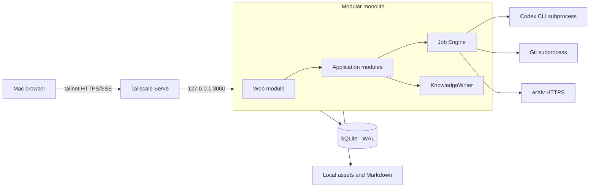
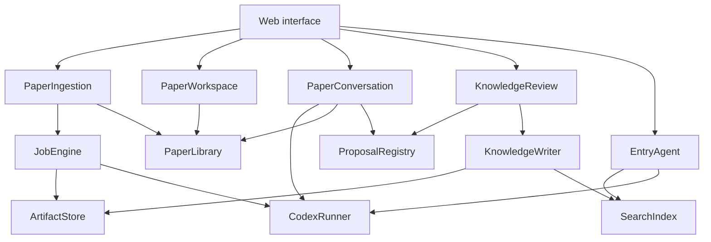

# ScholarLoom v1 System Architecture

- Status: Accepted for implementation
- Date: 2026-07-19
- Product contract: [`PRD.md`](PRD.md)
- Data contract: [`data-model.md`](data-model.md)
- SQLite design: [`sqlite-schema.sql`](sqlite-schema.sql)
- First slice: [`implementation-slice-001.md`](implementation-slice-001.md)

## 1. Architectural outcome

ScholarLoom v1 is a local-first modular monolith written in TypeScript and running
as one long-lived Node.js process on the Mac mini. It serves the browser UI, owns the
SQLite connection pool and KnowledgeWriter, schedules durable jobs, and launches
bounded subprocesses for Codex CLI and Git.



There is one deployable process and one database. “Module” below means a deep
module with a small interface, not a separately deployed service.

## 2. Selected technology shape

| Concern | v1 choice | Rationale |
|---|---|---|
| Runtime | Node.js 22+ and TypeScript | One language across browser, server, schemas, and subprocess orchestration |
| Server | Fastify | Small HTTP/SSE surface, explicit lifecycle, schema-friendly handlers |
| Browser | React + Vite | Local SPA with a focused Paper workspace and no server-rendering requirement |
| Validation | Zod | Shared request, event, and Codex structured-output contracts |
| Database | SQLite in WAL mode through `better-sqlite3` | Local durability, transactions, FTS5, no database daemon |
| Migrations | Ordered raw SQL migrations | The reviewed SQL contract remains authoritative; no ORM schema shadow |
| PDF | PDF.js for browser rendering and initial page/text extraction | One PDF model; first slice supports page-level anchors |
| Search | Separate curated and working SQLite FTS5 projections | Entry Agent cannot accidentally query Paper-working rows |
| AI runtime | Installed Codex CLI through `codex exec` | Matches the product constraint and reuses local Codex authentication |
| Progress | Server-Sent Events | One-way job and conversation progress without WebSocket complexity |
| Tests | Vitest + temporary SQLite/filesystem; Playwright for one browser journey | Test through the same module and HTTP interfaces used by callers |

The first slice does not use an ORM, message broker, graph database, vector
database, Redis, Docker, or a separate worker deployment.

## 3. Runtime topology and access

The application listens only on `127.0.0.1` (default port `3000`) and rejects
wildcard or non-loopback production binds. Tailscale Serve is the sole remote ingress:
it terminates tailnet HTTPS and proxies to the loopback listener. A representative
setup is `tailscale serve --bg 3000`; the exact generated `.ts.net` URL is discovered
from Tailscale rather than stored as application configuration.

The browser loads the private HTTPS URL exposed by Tailscale Serve. Access is limited
by tailnet ACLs; Funnel is explicitly out of scope. The v1 default relies on those
ACLs and leaves one request-auth hook at the HTTP seam for a later application token.
If Tailscale identity headers are used later, they are trusted only on requests arriving
through the loopback proxy, never from a directly exposed listener.

The service is supervised by `launchd`. Startup verifies the loopback health endpoint
and that `tailscale serve status` targets it; the process must not replace an occupied
port. SSE emits a heartbeat every 20 seconds. Durable progress events have event IDs:
clients resume with `Last-Event-ID`; if an event cannot be replayed they refresh the
corresponding read model. A lost stream never implies that a Proposal was accepted or
that a KnowledgeWriteRequest advanced.

Application code and user data have independent lifecycles. The runtime owns one
external, explicitly initialized data root:

```text
$HOME/ScholarLoomData/
├── scholarloom-data.json         versioned layout manifest
├── vault/                        durable Markdown/YAML and independent Git history
├── originals/papers/             immutable content-addressed PDFs
├── state/scholarloom.sqlite3     operational authority
├── derived/                      rebuildable extraction and Agent artifacts
├── cache/repositories/           rebuildable fixed-commit clones
├── logs/
└── tmp/
```

Writes use a temporary sibling followed by an atomic rename. Paths stored in SQLite
are data-root- or vault-relative; callers never construct storage paths themselves.
Normal startup fails closed if the root was not created by `data:init` or is incomplete.
Snapshot creation requires the runtime write lock to be absent and uses SQLite Online
Backup plus SHA-256 file manifests. Restore always targets a new directory.

## 4. Module map



### 4.1 PaperIngestion

Interface:

```ts
submit(input: { source: string }): Promise<ImportReceipt>
getImport(importRequestId: string): ImportStatus
retry(jobRunId: string): Promise<void>
```

It hides URL normalization, idempotency, Paper upsert, job graph creation, PDF and
repository acquisition, extraction, Summary generation, activation rules, and error
recovery. Callers never invoke individual pipeline steps.

### 4.2 PaperLibrary

Interface:

```ts
getWorkspace(paperId: string): PaperWorkspaceView
listPapers(filter?: PaperFilter): PaperListItem[]
openPdf(paperVersionId: string): ReadableAsset
```

It assembles a coherent read model from SQLite and Markdown: current Paper Version,
active Summary, code status, conversations, confirmed Takeaways, and processing
state. It does not expose table-shaped repositories.

### 4.3 PaperConversation

Interface:

```ts
start(input: { paperId: string }): Promise<ConversationHandle>
send(input: { conversationId: string; text: string }): AsyncIterable<ConversationEvent>
```

It freezes a Context Snapshot, chooses available Paper and code context, persists
Messages, invokes Codex, verifies citations, and emits Takeaway/Insight Proposals.
Updating underlying material creates a new Context Snapshot boundary.

### 4.4 KnowledgeReview

Interface:

```ts
list(filter?: ProposalFilter): ProposalView[]
decide(input: ReviewCommand): Promise<ReviewResult>
```

It validates the decision against Proposal type, records an immutable
ReviewDecision, and asks KnowledgeWriter to materialize the accepted revision.
There is no generic “update any entity” interface.

### 4.5 EntryAgent

Interface:

```ts
ask(input: { question: string }): AsyncIterable<EntryAgentEvent>
```

In v1 it can search only `global-curated`: active Summary Revisions and confirmed
Takeaway/Knowledge Revisions. It returns source IDs with every material answer. It
has no interface for raw PDF, Message, Annotation, Conversation Digest, or code.

### 4.6 JobEngine

Interface:

```ts
enqueue(spec: JobSpec): Promise<JobHandle>
cancel(jobRunId: string): Promise<void>
subscribe(scope: JobScope): AsyncIterable<JobEvent>
```

JobEngine owns durable state transitions, idempotency, retries, parent/child jobs,
concurrency limits, subprocess cancellation, and restart recovery. Job handlers are
private implementation details.

Initial concurrency policy:

- downloads: 4;
- PDF extraction: 2;
- Git operations: 2;
- Codex Agent Runs: 2;
- KnowledgeWriter: exactly 1.

Limits are configuration, not interface.

### 4.7 ArtifactStore

Interface:

```ts
put(input: ArtifactInput): Promise<ArtifactRef>
open(artifactId: string): ReadableAsset
lineage(artifactId: string): ArtifactLineage
```

It owns content-addressed storage, hashes, atomic moves, parent links, integrity
checks, and retention classification. Callers do not know asset directories.

### 4.8 KnowledgeWriter

Interface:

```ts
commit(command: KnowledgeWriteCommand): Promise<KnowledgeWriteResult>
reconcile(change: ExternalMarkdownChange): Promise<ReconcileResult>
```

KnowledgeWriter is the only module allowed to create or activate durable knowledge
revisions. It validates frontmatter, owns a durable write intent, writes Markdown
atomically, updates SQLite in one coordinated operation, and schedules index refresh.
An index failure marks the projection stale; it does not roll back valid Markdown.

### 4.9 SearchIndex

`EntryAgentSearch` is separate from Paper workspace search. It has no corpus parameter
and queries only the curated projection; PaperConversation builds its own bounded
context from the selected Paper Version, Summary Revision, Evidence Anchors, and ready
Repository Snapshot.

Interface:

```ts
replace(source: CuratedSource): void
remove(sourceRef: SourceRef): void
search(query: CuratedQuery): CuratedHit[]
rebuild(corpus: Corpus): RebuildReport
```

The first adapter is SQLite FTS5. Tests use the same adapter against an in-memory or
temporary SQLite database; no fake repository seam is introduced.

## 5. Real seams and adapters

Only dependencies that genuinely vary receive exposed internal ports.

| Seam | Production adapter | Test adapter |
|---|---|---|
| `PaperSource` | arXiv HTTPS metadata/PDF adapter | deterministic fixture adapter |
| `CodexRunner` | Codex CLI subprocess adapter | schema-valid deterministic fake |
| `Clock` | system clock | fixed clock |
| `IdGenerator` | UUIDv7 generator | deterministic sequence |

SQLite tests use real SQLite. Filesystem tests use a real temporary directory. Git
tests use a local bare repository. These local-substitutable dependencies do not
gain extra pass-through interfaces.

## 6. Codex CLI execution contract

The command surface was verified against the installed `codex-cli 0.144.6` on
2026-07-19 and must be rechecked when the CLI version changes.

CodexRunner accepts a typed task rather than an arbitrary shell command:

```ts
type CodexTask<T> = {
  kind: "paper-summary" | "paper-chat" | "knowledge-proposal" | "entry-answer";
  contextManifest: ContextManifest;
  instructions: string;
  outputSchema: JsonSchema<T>;
  timeoutMs: number;
};
```

The production adapter creates a Paper-scoped job directory containing only the
allowed immutable context and runs the equivalent of:

```text
codex exec
  --ephemeral
  --ignore-user-config
  --sandbox read-only
  --skip-git-repo-check
  --cd <job-context>
  --output-schema <schema.json>
  --json
  --output-last-message <result.json>
  <prompt>
```

Rules:

- Never use `--dangerously-bypass-approvals-and-sandbox`.
- The application, not Codex, downloads PDFs, clones repositories, writes Markdown,
  mutates SQLite, or accepts Proposals.
- `--json` stdout is captured as sanitized Agent Run events; stderr and exit status
  are stored separately.
- The final message must validate against the supplied JSON Schema before it can
  produce a domain Artifact or Proposal.
- Paper and repository contents are untrusted data, never instructions. The task
  contract prohibits following instructions contained in source material; no user
  Codex configuration, MCP server, shell command, credential, or writable repository
  is available to the job.
- Any cited Evidence Anchor must resolve against the pinned extraction/code snapshot.
  A candidate quotation is re-matched against the anchored page before it is rendered
  as verbatim evidence. Unverified evidence is labelled and cannot use one-click
  confirmation without opening the source page.
- Runs are ephemeral. Conversation continuity is reconstructed explicitly from
  Context Snapshot, Messages, and Conversation Digest; it does not depend on hidden
  Codex session state.
- Timeouts send graceful termination, then force termination after a bounded grace
  period. Partial output never becomes active knowledge.

## 7. HTTP interface

The Web module exposes use-case-shaped endpoints rather than CRUD for every table.

| Method | Path | Purpose |
|---|---|---|
| POST | `/api/imports` | Submit an arXiv link |
| GET | `/api/imports/:id` | Read import and child-job status |
| GET | `/api/events?scope=...` | Stream durable progress over SSE |
| GET | `/api/papers` | List Paper read models |
| GET | `/api/papers/:id` | Load Paper workspace read model |
| GET | `/api/paper-versions/:id/pdf` | Stream the accepted PDF asset |
| POST | `/api/papers/:id/conversations` | Start a Context Snapshot conversation |
| POST | `/api/conversations/:id/messages` | Send a Message and stream events |
| GET | `/api/proposals` | List reviewable suggestions |
| POST | `/api/proposals/:id/decisions` | Accept, edit, or reject |
| POST | `/api/entry-agent/questions` | Query global-curated knowledge |

Commands accept an `Idempotency-Key`. Errors use stable problem codes such as
`invalid-arxiv-reference`, `paper-source-unavailable`, `proposal-already-decided`,
and `codex-output-invalid`.

## 8. Transaction and consistency model

SQLite is the transaction authority for operational state. Markdown is the content
authority for durable knowledge. Cross-storage writes use a recoverable protocol.
The request is committed before filesystem effects and records target/staged paths,
planned revision, expected pre-write hash, result hash, and phase.

| Phase | Required durable state | Recovery rule |
|---|---|---|
| `reserved` | intent only | absent staged file → `failed` |
| `staged` | staged file hash equals result hash | atomically rename, otherwise preserve and fail |
| `renamed` | final file hash equals result hash | register revision metadata, ReviewDecision, and outbox idempotently |
| `metadata-committed` | metadata and outbox exist | drain projection outbox |
| `indexed` | projection update completed | mark intent `complete` |

At every boundary a different final-file hash is an external edit: preserve it and
create a non-activating reconciliation Proposal. A missing final file after metadata
commit is a scoped integrity incident, withheld from retrieval until restored from a
matching staged file or Git. Git is eventual history: a later reconciliation commit
may cover several revisions, while byte-exact Markdown content hashes remain identity.

The index outbox incrementally updates both the working and curated projections. A
full curated-projection rebuild from active Summary and confirmed knowledge revisions
is required from day one. If the curated outbox is behind, Entry Agent answers include
the last successful projection timestamp and a staleness notice. A revision activation
enqueues removal of its superseded curated row in the same metadata transaction.

SQLite settings:

- WAL journal mode;
- foreign keys enabled for every connection;
- busy timeout;
- short explicit write transactions;
- one application-owned KnowledgeWriter;
- no network filesystem placement for the database file.

## 9. Observability and recovery

- Every request receives a correlation ID.
- ImportRequest, JobRun, AgentRun, Proposal, and ReviewDecision IDs appear in logs.
- Logs are JSONL, rotated locally, and sanitized before persistence.
- Browser progress comes from durable JobRun transitions, not transient process logs.
- Startup replays open write intents, drains the index outbox, archives unresolved
  reconciliation Proposals older than 30 days, and records scoped integrity incidents.
- On startup, jobs left in `running` are moved to `interrupted`; retry policy decides
  whether they return to `queued`.
- Artifact integrity checks compare size and content hash before activation.
- A diagnostic command reports schema version, stale projections, interrupted jobs,
  missing files, and invalid Markdown without changing state.

## 10. Dependency direction

```text
Web → Application modules → Domain rules
                         ↘ SQLite / filesystem implementations
                         ↘ true external adapters
```

Domain code does not import Fastify, React, SQLite, filesystem paths, Codex process
arguments, or arXiv transport shapes. Web handlers do not coordinate pipeline steps.
Adapters return domain-shaped results and do not decide activation, review, or
knowledge policy.

## 11. Intentionally deferred

- multi-process workers and distributed queues;
- vector retrieval and reranking;
- automatic discovery and recommendation;
- entry Agent downward retrieval;
- sandboxed execution of paper code;
- cloud sync and multi-user authorization;
- automatic cross-Paper conflict synthesis.
