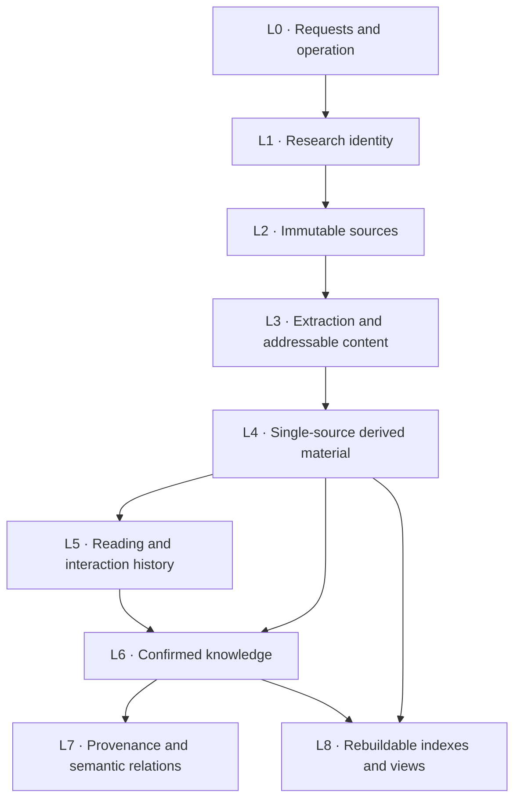
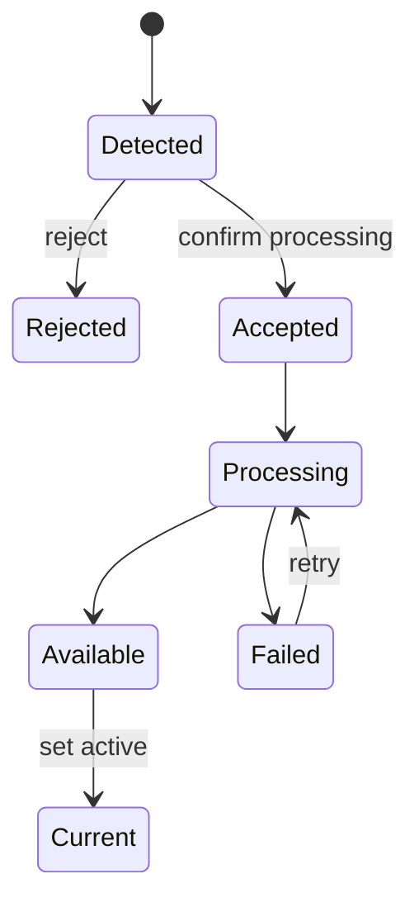
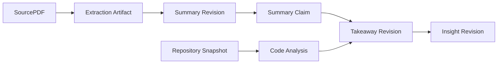
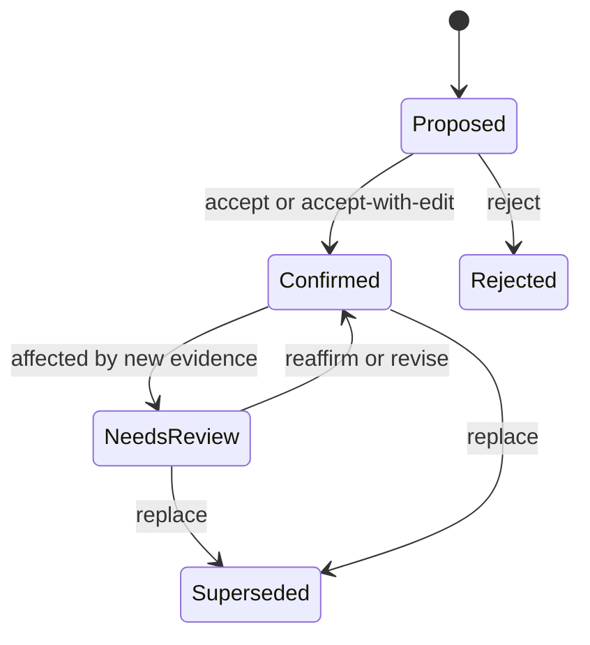

# ScholarLoom v1 Data Model

- Status: Accepted baseline
- Version: 1.1
- Accepted: 2026-07-19
- Scope: single-Paper deep-reading MVP
- Vocabulary: [`CONTEXT.md`](../CONTEXT.md)
- SQLite design: [`sqlite-schema.sql`](sqlite-schema.sql)

## 1. Purpose

This document is the v1 data contract for ScholarLoom. It defines identity,
authority, versioning, provenance, lifecycle, storage ownership, review boundaries,
and index visibility. It deliberately does not define the future global Agent's
downward retrieval algorithm or the automatic paper-discovery model.

The model must preserve a complete chain from an answer or confirmed idea back to
the exact Paper Version, PDF region, Message, or code commit that informed it.

## 2. Non-negotiable invariants

1. A Paper is a stable scholarly-work identity; a Paper Version is immutable.
2. arXiv, DOI, and conference forms of the same work belong to one Paper.
3. A new Paper Version is processed only after user confirmation. An explicit arXiv
   `vN` request is immutable; a bare ID is resolved once to a concrete version.
4. Source PDF and Repository Snapshot content never changes in place.
5. Any derived content used downstream is retained and addressable by revision.
6. Evidence ultimately resolves to a PDF page/coordinate or fixed code commit/line,
   not only to an unstable parsed chunk.
7. Conversation is process history, not confirmed knowledge.
8. Takeaway is Paper-scoped; Knowledge Node is reusable across Papers.
9. Proposed content is not knowledge until a Review Decision accepts it.
10. Provenance Link and Semantic Relation are different domain concepts.
11. Long-term knowledge is human-readable; operational state may use structured storage.
12. Indexes and navigation views are disposable projections.
13. The MVP entry Agent cannot search raw PDF, full Messages, Annotation, or code.
14. Parallel jobs cannot directly perform concurrent long-term knowledge writes.
15. The MVP Entry Agent queries only a curated-only projection, never the shared
    Paper working corpus.

## 3. Layer map



| Layer | Canonical objects | Authority |
|---|---|---|
| L0 Requests and operation | ImportRequest, JobRun, AgentRun, Proposal, ReviewDecision | Operational audit |
| L1 Research identity | Paper, ExternalIdentity, PaperVersion, CodeRepository, RepositorySnapshot, PaperCodeLink | Resolved identity |
| L2 Immutable sources | SourcePDF, supplementary asset, repository files | Primary source |
| L3 Extraction | ExtractionRun, DocumentElement, EvidenceAnchor, CodeElement, RepositoryDigest | Replaceable derived material |
| L4 Single-source derivation | SummaryRevision, SummarySection, SummaryClaim, CodeAnalysis, ConversationDigest | AI-derived material |
| L5 Reading and interaction | Conversation, ContextSnapshot, Message, Annotation | User and interaction history |
| L6 Confirmed knowledge | Takeaway, TakeawayRevision, KnowledgeNode, KnowledgeRevision | User-confirmed knowledge |
| L7 Connections | ProvenanceLink, SemanticRelation | Traceability and reviewable interpretation |
| L8 Projections | Search entries, vector index, graph projection, Wiki navigation | Rebuildable view |

`Artifact` is a shared technical envelope across L2–L4 and any persisted output in
later layers. It records content identity and lineage without replacing the domain
object that gives the content meaning.

## 4. Storage ownership

| Storage | Authoritative for | Not authoritative for |
|---|---|---|
| Markdown/YAML | Summary, Takeaway, Knowledge Node, human-maintained Paper knowledge | Jobs, Messages, indexes |
| Local asset filesystem | PDF, extracted media, supplementary files, repository objects | Knowledge state |
| SQLite | identity metadata, versions, Messages, job state, proposals, reviews, relation records, file references | Human-readable knowledge bodies |
| Derived stores | full-text, vectors, graph projection, Wiki navigation | Any irreplaceable content |

Markdown supports external editing. A reconciler validates external changes and
updates metadata and indexes. Invalid Markdown is preserved and reported. SQLite
must never overwrite a newer external edit.

An external edit is not automatically a conflict: a valid file with no competing
application write becomes a non-activating `markdown-reconciliation` Proposal. A
conflict exists only when a durable `KnowledgeWriteRequest` expects one byte-exact
canonical file but finds a different valid file while committing or recovering. The
external file is preserved; the existing active revision remains active until a
Review Decision accepts the Proposal. Invalid files are preserved but neither indexed
nor activated. A missing canonical file for an already registered revision is a
scoped integrity incident, withheld from retrieval and recovered only from a matching
staged file or Git history. It is never recreated from SQLite metadata.

## 5. Research identity

### 5.1 Paper

Paper is the deduplication boundary for one scholarly work.

Required concepts:

- Stable internal ID.
- One or more External Identities, including arXiv ID and DOI.
- Acquisition status: `metadata-only`, `queued`, `ingested`, `unavailable`, or `deleted`.
- Accepted `current_version_id`.
- Origin, initially `manual-import` or `reference-discovery`.

For a public direct PDF, each normalized submitted URL is an External Identity of type
`direct-pdf-url`; a safely redirected final URL is recorded as its canonical URL. URL
identity and immutable content identity are deliberately separate. Different URLs with
the same verified SHA-256 PDF hash attach to one Paper and Paper Version while retaining
both External Identities.

A citation may create a metadata-only Paper. Importing it later upgrades the same
entity rather than creating another Paper.

### 5.2 Paper Version

Paper Version represents an immutable arXiv or publication form. It owns its PDF,
Extraction Runs, Summary Revisions, and version-specific citation facts. Every
downstream reference uses a concrete `(source id, source version, resolved_at)`;
versionless arXiv identity exists only at request parsing time.

The user normally views only the accepted current version. An explicit arXiv `vN`
URL imports exactly `vN`; a bare arXiv ID resolves to the latest version once and
then freezes. A version check on Paper open creates a `paper-version-update`
Proposal when a newer version exists. No update download or derived processing occurs
until the Proposal is accepted.



The formally published version and arXiv versions may coexist. Date alone does not
decide which one is current.

A direct PDF Paper Version uses `source_type = direct-pdf` and
`source_version = sha256:<content-hash>`. A known URL returning new bytes creates a
detected Paper Version and `paper-version-update` Proposal; current content is not
changed until review. Review opens the candidate Artifact and, on acceptance, makes it
current before running the existing extraction and Summary lifecycle. Retry input freezes the source identity, canonical URL, content
hash, and stored PDF Artifact.

### 5.3 Code Repository and Snapshot

Code Repository is shared across Papers. Repository Snapshot is a fixed commit.
PaperCodeLink records:

- relation: `official`, `author`, `third-party-reproduction`, or `unknown`;
- evidence for the match;
- review state;
- the Paper's default Repository Snapshot.

A manual repository root URL creates or reuses a confirmed PaperCodeLink immediately;
its independent materialization Job then fixes the repository's current default-branch
commit. Paper ingestion does not detect or create repository associations. Historical
detected candidates remain representable for compatibility, but only explicit user
commands may confirm, remove, or replace their trust state. Search, ranking, and fuzzy
inference are outside this slice.

The existing `status` and `origin` fields express candidate/confirmed state and
detected/manual origin, so no migration or parallel association table is required.
A URL establishes repository identity but not authority, so v1 records relation as
`unknown` rather than claiming `official`. Materialization state and failure detail
live in durable `job_runs`; successful links point to immutable Repository Snapshots.
Canonical repository identity makes duplicate adds idempotent. Shared ready snapshots
are reused across Papers. Archived Papers keep associations readable but reject add,
confirm, retry, and remove commands. Remove sets the PaperCodeLink to `rejected` while
preserving repository identity and its snapshot pointer; a durable synchronous
`job_runs` record makes the command replay-safe. Re-adding the same canonical URL
reactivates the link as `manual`. Rejected links do not enter future Context Snapshots.

## 6. Artifact lineage and evidence

### 6.1 Artifact

Every persisted, versionable material output has:

- stable ID and type;
- content hash and storage reference;
- parent Artifact IDs;
- creator: external source, parser, Agent Run, or user;
- creation time;
- retention policy and integrity state.



### 6.2 Extraction Run and Document Element

Each parser attempt creates an Extraction Run. One run is active for new work.
Older runs referenced by a Summary, Message answer, Takeaway, or Knowledge Revision
must be retained. Unreferenced failed or temporary runs may be garbage-collected.

Document Element provides a common addressable unit with type-specific data for:

- section;
- text block;
- equation;
- table;
- figure;
- caption.

It records reading order, section path, page, PDF coordinates, extracted content,
relationships to other elements, and extraction confidence.

### 6.3 Evidence Anchor

Evidence Anchor locates a source at two levels:

1. a convenient Document Element or Code Element;
2. a durable fallback in an immutable source: Paper Version plus PDF page/coordinates,
   or Repository Snapshot plus file and line range.

Reprocessing a PDF may improve the convenient locator but cannot silently move the
durable source location used by an existing revision.

## 7. Derived understanding

### 7.1 Paper Summary

Paper Summary is based only on a Paper Version and follows the versioned
`paper-reading` Skill. A Summary Revision includes:

- canonical Markdown;
- Skill content hash, Agent Run, Paper Version, and Extraction Run;
- generated reading depth and generation metadata;
- derived Summary Sections matching the Skill structure;
- selected Summary Claims with claim voice and Evidence Anchors.

Claim voice is one of `authors-claim`, `paper-evidence`, or `agent-assessment`.
Sections and Claims are rebuildable from canonical Markdown and cannot become a
second drifting copy of the Summary.

The first successful Summary becomes active automatically. Later regenerations are
`summary-replacement` Proposals. A previously read, discussed, or cited revision is
retained even after replacement.

### 7.2 Code Analysis

Code Analysis is derived from both a Paper Version and Repository Snapshot. It is
displayed as an implementation supplement rather than merged into Paper Summary.
It may describe architecture, entry points, paper-to-code mapping, and important
files. Repository Digest and Code Elements help Paper-scoped Agents locate source.

Paper Summary does not wait for code. Code observations enter global knowledge only
after becoming a confirmed Takeaway or Knowledge Revision.

### 7.3 Conversation Digest

Conversation Digest compresses a bounded Message range for Paper-scoped context.
It records the Context Snapshot and generation revision. It is derived process data,
not confirmed knowledge, and is never searched by the MVP entry Agent.

## 8. Reading and interaction

### 8.1 Conversation and Context Snapshot

Conversation belongs to one Paper. Each conversation segment records an immutable
Context Snapshot containing:

- Paper Version;
- Summary Revision;
- Extraction Run;
- zero or more Repository Snapshots.
- one immutable Knowledge Corpus Manifest containing other papers' active Summary
  Revisions and confirmed knowledge as of Conversation creation.

Updating a Paper, Summary, extraction, or repository does not reinterpret old
Messages. A Conversation has one set-once Context Snapshot in this slice; continuing
with newer material creates a new Conversation linked by `continuedFromConversationId`.
Migration diagnostics classify pre-slice rows as `frozen` or `legacy`. A legacy row
is readable but cannot create new Agent Runs or confirmed knowledge.

Conversation lineage is Paper-scoped and independent of archive lifecycle. Its read
model exposes the direct parent, direct successors, and a root-to-parent ancestor
breadcrumb. A deterministic Context Snapshot comparison classifies Paper Version,
Summary Revision, Extraction Run, Repository commit, and Knowledge Corpus Manifest
changes without mutating either snapshot. Repository comparison keys by
`code_repository_id`; Knowledge entries use the full
`(paperId, revisionId, contentHash)` identity.

A linked successor is rejected when the latest freeze candidate is semantically
identical to its parent. If the same parent already has a child with that candidate,
creation returns that child's identity as a conflict rather than silently reusing or
duplicating it. Legacy Conversations may still create a new frozen successor, but
their historical Context Diff is explicitly unavailable.

### 8.2 Message

Messages form immutable process history. They may be archived and are available to
the relevant Paper-scoped Agent, but they are not accepted personal knowledge and
are not searched by the MVP entry Agent.

Each user Message has a stable ordinal and one or more turn attempts. Attempt state
lives in `job_runs`; `conversation_turn_attempts` supplies retry lineage. At most one
attempt is non-terminal per Conversation and at most one assistant Message may reply
successfully to a user Message. Retry never inserts another user Message.

Agentic attempts refer to an `EvidenceWorkspace` registry row and append Activity and
Usage records under a matching run epoch. New assistant citations are final-only
`EvidenceReceipt` records. Each Receipt fixes source/revision, workspace path,
content/blob hash, line/page locator, and a bounded verbatim quote. Activity is never
treated as verified evidence. Legacy one-shot citations remain readable but receive
no synthetic Receipts.

### 8.3 Annotation

Annotation is a user highlight or note on an Evidence Anchor, Summary Section, or
Summary Claim. It is available to Paper-scoped work but not global search. Promotion
to Takeaway or Knowledge Node requires a Proposal and Review Decision. Migration to
a new Paper Version or Summary Revision is never silent.

## 9. Confirmed knowledge

### 9.1 Takeaway

Takeaway is an atomic conclusion about exactly one Paper. It must be grounded in a
Paper or code source and retains links to the Summary Claim, Message, Annotation,
or Code Analysis that led to it.

Takeaway Revision is immutable. Updating the wording or meaning creates another
revision. A Takeaway can support, challenge, or conflict with a Knowledge Node.

### 9.2 Knowledge Node

Knowledge Node provides a common lifecycle for these types:

- Insight;
- Concept;
- Topic;
- Question;
- Synthesis.

Each type has a dedicated Markdown body schema. Insight may be evidence-backed,
interpretation, hypothesis, or open question. A hypothesis without Paper evidence
is valid when explicitly marked and attributed as user-confirmed interpretation.

Turning an Insight into a Concept creates a new node connected by `derived-from`;
it does not mutate the node's type in place.

### 9.3 Revision lifecycle



Confirmed revisions never change in place. Rejected proposals retain a minimal
audit record so the same suggestion is not repeatedly generated.

## 10. Provenance and semantic relations

Provenance Link answers “where did this revision come from?” It may point to an
Evidence Anchor, Message, Summary Claim, Annotation, Takeaway Revision, or Knowledge
Revision. It is part of the audit chain.

Semantic Relation answers “how do these domain objects relate?” It includes type,
direction, provenance, confidence, review status, author, and time. Examples include
`extends`, `contradicts`, `same-research-line`, `supports`, and `challenges`.

Citation facts originate on Paper Version. A Paper-level citation graph is a
projection of the selected versions. Unambiguous citations are accepted
automatically; ambiguous identity matches remain Proposals.

Future synthesis should preserve conflict: multiple Takeaways may support,
challenge, or contradict the same Insight. Conflict must not be averaged into an
artificial consensus. Automated conflict grouping and review UI are outside v1.

## 11. Review and execution

### 11.1 Proposal and Review Decision

All pending changes share a Proposal envelope. v1 proposal types include:

- Paper Version update;
- inferred repository link;
- Summary replacement;
- Takeaway;
- Knowledge Node/Revision;
- Semantic Relation;
- Markdown reconciliation.

Proposal never enters Agent retrieval. Review Decision is an immutable event with
action such as `accept`, `accept-with-edit`, `reject`, `set-active`, `supersede`, or
`request-reprocess`.

### 11.2 Import Request, Job Run, and Agent Run

Import Request preserves the original user input and resolves it to one Paper.
Invalid or failed requests do not create incomplete Papers. A source-resolution failure
still completes a durable Import Request with `error_code` and `error_detail`, so the
original intent and reason remain inspectable without a Paper or Job Run.
For direct PDF references, the pending request exists before DNS or HTTP acquisition;
validated bytes are retained as an immutable Artifact even when required metadata is incomplete.

Job Run is the common observable execution record for identity resolution, download,
extraction, clone, indexing, reconciliation, and Agent work. It records idempotency,
inputs, outputs, progress, retry state, errors, timing, and sanitized logs.
For Paper imports, the input freezes the concrete Paper Version. A retry creates a new
attempt under the same Import Request, preserves earlier attempts, and never resolves
against a newer `current_version_id`. Replaying the retry command's Idempotency-Key
returns the same attempt. Job Run `succeeded`, `failed`, `cancelled`, and `interrupted`
states are terminal for monitoring. `failed` and `interrupted` may create a new retry
attempt; `cancelled` is terminal and non-retryable.

Agent Run extends Job Run with model, Skill hash, Context Snapshot, token usage, and
cost. Agent Runs are operational audit and are not Conversation Messages or knowledge.
For Paper Summary output, every structured claim references exactly one opaque source
handle enumerated by its immutable Context Snapshot; the application resolves that
handle to an Evidence Anchor before activating the Summary.

### 11.3 Write coordination

Read, download, parsing, code indexing, Agent generation, and Proposal generation may
run concurrently. Long-term knowledge writes are serialized through a durable intent:

```text
Proposal / UI edit / external Markdown edit
  → reserve KnowledgeWriteRequest
  → render and validate staged Markdown
  → atomic canonical rename
  → SQLite metadata and index-outbox transaction
  → projection update
  → complete
```

The intent stores target/staged paths, the expected pre-write hash, result hash, and
planned revision. Summary intents also store byte-exact planned Markdown so an explicit
retry can reconstruct a missing staged Summary without rerunning the Agent. Phases are
`reserved → staged → renamed → metadata-committed → indexed → complete`, with
terminal `failed` and `conflicted`.
Hashes remain the only recovery tiebreaker. Matching state rolls forward; a mismatch
preserves the file and creates a Proposal. Other write types require a matching staged
file or Git history when their canonical file is missing.
Agents do not directly race to edit knowledge files. Index failure does not roll back
valid knowledge; it marks the relevant projection stale and retries.

### 11.4 Takeaway Distillation Run

An eligible grounded assistant Message owns an automatic Takeaway Distillation Job.
The immutable Distillation Context Manifest freezes the Paper/Paper Version, source
Message hashes, verified Evidence Receipt identities and hashes, active Summary,
confirmed Paper Takeaways, trigger/focus hash, and contract/prompt hashes.

`takeaway_distillation_runs` binds this manifest to the existing `job_runs` lifecycle.
Its terminal domain outcome is either durable `no-proposal` with a stable reason code,
or one V2 Takeaway Proposal. Operational failure, timeout, interruption, and retry
remain Job states and never degrade into a weaker Proposal. One terminal outcome is
unique by assistant Message, contract version, trigger, and focus hash.

V2 Proposal payload stores advisory kind, standalone claim, epistemic status, evidence
rationale, caveat, verified Receipt IDs, selection rationale, duplicate hints, title,
contract version, trigger, and Distillation Job identity. Selection rationale,
duplicate hints, and focus never enter confirmed Markdown.

## 12. Search corpora

The data boundary is fixed even though future downward retrieval is not designed.

### global-curated

Searchable by the MVP entry Agent:

- active Summary Revisions, marked `generated-from-primary-source`;
- confirmed Takeaway Revisions, marked `user-confirmed`;
- active confirmed Knowledge Revisions, marked `user-confirmed`.

This corpus has its own FTS projection in the same SQLite database. `EntryAgentSearch`
is its sole query interface; it cannot query the shared working-corpus FTS. The
projection is updated from the outbox and can be deterministically rebuilt from
canonical active Summary and confirmed knowledge Markdown. Rebuild reads the vault
files and verifies their recorded hashes; SQLite structured columns are operational
metadata and cannot silently replace the knowledge authority. When the outbox is behind,
the Entry Agent may answer from the last good projection but must display an indexing
staleness notice and its last successful update time.

When a new Takeaway or Knowledge Revision becomes active, the same metadata/outbox
transaction removes the superseded revision from this projection. Curated retrieval
therefore returns one active revision per logical node, while historical revisions
remain available through their Paper/knowledge history rather than global answer search.

### paper-working

Available only within the relevant Paper workspace:

- Document Elements;
- Messages and Conversation Digests;
- Annotations;
- Repository Digest, Code Elements, and Code Analysis.

### operational

Never Agent-searchable:

- Job and Agent Runs;
- Proposals and Review Decisions;
- storage and reconciliation metadata.

Every index entry records the precise source ID/revision, content hash, corpus,
visibility scope, indexer version, and active/superseded state. Index separation does
not decide future routing or ranking.

## 13. Retention, deletion, and backup

### 13.1 Retention classes

| Class | Examples | Backup |
|---|---|---|
| Irreplaceable | knowledge Markdown, Messages, Annotation, reviews, user config, source PDF | Required |
| Historical | referenced Extraction Run, Summary/Knowledge revisions, Agent Run metadata, pinned Git objects | Required |
| Rebuildable | full-text/vector indexes, graph and Wiki projections, unreferenced temporary parses | Excluded |

Backups should be local and encrypted, include a manifest and content hashes, and
preserve Git objects for pinned commits that could disappear upstream.

Physical deletion of immutable Paper Versions, Artifacts, Summary Revisions, Takeaway
Revisions, and Knowledge Revisions is forbidden by the application and guarded in the
target schema. Lifecycle changes use status/tombstones and supersession links instead.

Unresolved Markdown reconciliation Proposals remain preserved forever. After 30 days
they are archived from the active queue but remain inspectable and may be reopened;
they are never silently deleted.

### 13.2 Conversation deletion

Archive is the default. Hard deletion performs a dependency check. If a confirmed
revision depends only on deleted Messages, the user must delete it, retain it with
`provenance-missing`, or cancel. A content-free tombstone may preserve audit identity.

### 13.3 Paper deletion

Paper supports three levels:

1. `archive`: hide from normal use;
2. `purge-content`: remove local Paper content after dependency review while keeping
   identity and a tombstone;
3. `forget-identity`: explicitly remove the tombstone and suppression memory.

Purging removes Paper-owned sources and projections but not a Code Repository shared
by another Paper. Citation links to a purged Paper remain connected to its tombstone.

## 14. v1 aggregate outline

```text
Paper
├── ExternalIdentity[]
├── PaperVersion[]
│   ├── SourcePDF
│   ├── ExtractionRun[]
│   │   └── DocumentElement[]
│   ├── SummaryRevision[]
│   │   ├── SummarySection[]
│   │   └── SummaryClaim[]
│   └── version-specific citation relations
├── PaperCodeLink[]
│   └── CodeRepository
│       └── RepositorySnapshot[]
│           ├── RepositoryDigest
│           ├── CodeElement[]
│           └── CodeAnalysis[]
├── Conversation[]
│   ├── ContextSnapshot[]
│   ├── Message[]
│   └── ConversationDigest[]
├── Annotation[]
└── Takeaway[]
    └── TakeawayRevision[]

KnowledgeNode
├── KnowledgeRevision[]
└── type: Insight | Concept | Topic | Question | Synthesis

Cross-cutting
├── Artifact lineage
├── EvidenceAnchor
├── VisualRenderArtifact / VisualPageInspection / VisualEvidenceReceipt
├── ProvenanceLink
├── SemanticRelation
├── Proposal / ReviewDecision
└── ImportRequest / JobRun / AgentRun
```

Visual Evidence Receipts are authoritative historical records attached to committed
Messages. They freeze the source PDF hash, page, renderer fingerprint/settings, image
hash, and bounded observation. Rendered PNGs remain rebuildable derived data. A render
artifact is GC-pinned exactly while reachable from a Visual Receipt; cache loss does
not delete or mutate the Receipt. Rebuild mismatch creates render-drift presentation
state while preserving the Message and immutable receipt metadata.

## 15. Explicitly deferred

- DiscoverySource, InterestProfile, DiscoveryRun, recommendation ranking, and feedback model.
- Entry Agent retrieval below Summary and confirmed knowledge.
- Automatic conflict clustering and synthesis across Paper Takeaways.
- Sandbox execution and experimental reproduction of repository code.
- Cloud sync, multiple writers, and multi-user permissions.
