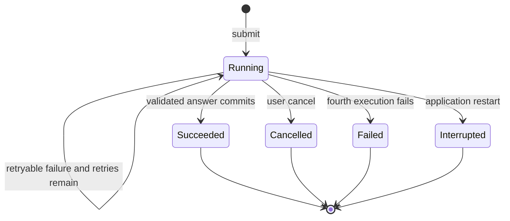

# Knowledge Question 功能设计

- Status: accepted; Slices 014–015 implemented and verified, Slice 016 planned
- Date: 2026-08-22
- Product baseline: [`PRD.md`](PRD.md)
- Architecture baseline: [`architecture.md`](architecture.md)
- Data model baseline: [`data-model.md`](data-model.md)
- Browser baseline: [`frontend-information-architecture.md`](frontend-information-architecture.md)
- Agent decision: [`ADR 0016`](adr/0016-codex-native-curated-knowledge-questions.md)
- Visual target: standalone `知识问答` top-level destination with a recent-conversation sidebar, grounded answer body, source drawer, retrieval disclosure, and persistent composer.
- Implementation: Slices 014–016 under [`plans/`](plans/).

## 1. Purpose

The former Entry Agent was a one-shot question on Research Home. It performed host-side
FTS recall, gives Codex at most eight preassembled sources, returns one answer, and
does not create a durable global conversation. This is useful as a tracer but does not
support the accepted Knowledge Question experience:

- a dedicated top-level destination;
- multiple durable Knowledge Conversations;
- follow-up questions with visible continuity;
- Codex-native decisions about whether, what, and how much to retrieve;
- iterative curated retrieval instead of a fixed eight-source candidate set;
- verified source-level evidence and explicit Agent inference;
- general Codex answers when the curated corpus has no result, clearly labeled as
  unsupported by the knowledge base.

The implemented Knowledge Question flow replaces that one-shot browser flow without weakening the `global-curated`
corpus boundary. It does not change Paper-scoped Conversation, frozen Context Snapshot,
or Agentic Evidence semantics.

## 2. Confirmed product decisions

1. `知识问答` is a top-level navigation destination separate from Research Home.
2. A new Knowledge Conversation starts only from Research Home or the Knowledge
   Question page. Paper, Topic, Summary, and Review pages do not start one in this
   release.
3. Every turn asks Codex to decide whether to reuse conversation context, search
   `global-curated`, or answer from model knowledge. A planning decision does not imply
   a mandatory search.
4. Codex owns query decomposition, search wording, iterative retrieval, coverage
   checks, source selection, disagreement detection, and answer composition.
5. ScholarLoom owns corpus eligibility, tool permissions, deterministic search
   execution, budgets, source identity, citation verification, persistence, retries,
   cancellation, and presentation labels.
6. Active Summary Revisions are eligible as `generated-from-primary-source`; there is
   no separate Summary review or lower-trust "unreviewed Summary" state.
7. Confirmed Takeaway Revisions and active knowledge-ready Topic Revisions are eligible
   as `user-confirmed`. Proposals, classification-only Topics, raw PDF, full Messages,
   Annotation, code, and operational records remain excluded.
8. Retrieval has safety ceilings, not a fixed product-level source count. Codex may
   search repeatedly and use fewer or more sources according to the question.
9. A turn with no curated result may still return a normal Codex answer. The browser
   labels it `通用回答 · 无知识库证据`, shows no fabricated source markers, and preserves
   uncertainty.
10. A canceled or finally failed turn creates no Knowledge Message. A new empty
    Knowledge Conversation is not persisted before its first successful turn.
11. One submission receives an initial Codex execution and at most three automatic
    retries for retryable infrastructure or invalid-output failures. Exhaustion shows
    an error and allows a new manual submission.
12. Knowledge Conversations can be renamed, archived, and restored. Hard deletion is
    deferred.
13. Knowledge updates never mutate old answers and do not add "evidence updated"
    notices. A source that can no longer be opened remains visible but gray and
    non-interactive.

## 3. Browser routes and entry flow

Top-level navigation order:

```text
研究首页 / 知识问答 / 论文库 / 审核中心
```

Canonical routes:

| Purpose | Route |
|---|---|
| Knowledge Question landing/new draft | `/questions` |
| Saved Knowledge Conversation | `/questions/:knowledgeConversationId` |
| Archived list | `/questions?view=archived` |

Research Home retains a concise Knowledge Question input. Submit navigates to
`/questions`, starts a transient turn, and replaces the URL with the stable saved
Conversation route only after the first answer commits. Refresh during an unfinished
first turn may discard it; this follows the explicit no-save-on-cancel/failure rule.

The Knowledge Question page owns:

- new Conversation;
- active and archived Conversation lists;
- title, rename, archive, and restore actions;
- Message timeline;
- structured answer claims and source markers;
- source drawer;
- collapsed retrieval summary;
- follow-up composer and retrieval policy disclosure.

No manual Paper/Topic/year scope selector is required in the primary flow. A later
advanced correction control may supply explicit constraints, but user input is a hint
or constraint to Codex rather than the only routing mechanism.

## 4. Domain semantics

### 4.1 Knowledge Conversation is not Conversation

`Conversation` remains Paper-scoped and frozen by a Context Snapshot.
`KnowledgeConversation` is global-curated, multi-turn interaction history. Each new
turn sees the current eligible curated projection and bounded recent successful
Messages. Knowledge changes never reinterpret prior Messages because every grounded
answer stores immutable Evidence Receipts for the exact source revisions it used.

Knowledge Conversation does not own a Knowledge Corpus Manifest. It intentionally
uses live curated retrieval per turn. This distinction prevents nullable Paper fields
and conditional Context Snapshot rules from weakening the existing Conversation
aggregate.

### 4.2 Successful-turn-only persistence

The browser keeps the pending question locally while Codex runs. Operational state
records a question hash, attempt identity, progress, usage, and bounded error metadata,
but not the question text. On success one SQLite transaction:

1. creates the Knowledge Conversation when this is its first turn;
2. appends immutable user and assistant Knowledge Messages;
3. commits verified curated Evidence Receipts;
4. records the validated Agent Run;
5. marks the Job Run succeeded and advances the Conversation activity time.

Cancel, timeout after retry exhaustion, invalid output after retry exhaustion, or
infrastructure failure commits none of steps 1–4. Existing successful history remains
unchanged.

### 4.3 Answer basis and coverage

These dimensions are independent:

```ts
type KnowledgeAnswerBasis =
  | "curated-evidence"
  | "conversation-context"
  | "model-knowledge";

type KnowledgeCoverage =
  | "supported"
  | "partial"
  | "none"
  | "conflicting";
```

- `curated-evidence`: the answer uses at least one verified curated Receipt.
- `conversation-context`: no new research fact is introduced; the answer explains,
  reformats, or clarifies already visible conversation content.
- `model-knowledge`: Codex answers without curated evidence. It may not attach a
  source marker or imply that ScholarLoom supports the answer.

`coverage` describes the curated corpus, including `none` for a useful general answer.

## 5. Deep modules and seams

### 5.1 KnowledgeConversation module

This is the external application module. Callers do not construct prompts, search
queries, tool budgets, Job transitions, retry loops, Messages, or Receipts.

```ts
interface KnowledgeConversation {
  submit(input: {
    conversationId?: string;
    question: string;
    idempotencyKey: string;
  }): KnowledgeAttemptHandle;
  cancel(attemptId: string): Promise<void>;
  read(conversationId: string): KnowledgeConversationReadModel;
  list(view: "active" | "archived"): KnowledgeConversationSummary[];
  rename(conversationId: string, title: string): void;
  archive(conversationId: string): void;
  restore(conversationId: string): void;
}
```

Its implementation owns turn admission, bounded context, Codex dispatch, automatic
retry, citation commit, successful-turn-only persistence, and read models. Tests and
web handlers use this interface rather than internal storage methods.

### 5.2 KnowledgeAnswerRunner seam

Two adapters make this a real seam:

- production `CodexCliKnowledgeAnswerRunner`;
- deterministic fixture adapter for integration and browser tests.

One long-lived ephemeral `codex exec` handles one execution epoch. It receives recent
successful conversation context, application-owned Prompt/Schema contracts, and only
the curated stdio tools. It does not receive a host-selected evidence payload.

### 5.3 CuratedKnowledgeReader seam

Two adapters also exist here:

- production SQLite FTS/vault reader;
- real temporary SQLite/filesystem fixture adapter.

The interface is intentionally small:

```ts
interface CuratedKnowledgeReader {
  search(input: CuratedSearchInput): CuratedSearchPage;
  open(handle: string): CuratedSourceDocument;
  verify(input: CuratedCitationCandidate): VerifiedCuratedCitation;
  availability(source: CuratedSourceIdentity): SourceAvailability;
}
```

The reader never plans a query, selects final evidence, or writes knowledge. It
enforces eligibility and returns deterministic, source-addressed material.

## 6. Codex-native retrieval loop

The production runner exposes invocation-local tools:

### `search_curated_knowledge`

Input includes a Codex-authored query and optional source-type, Paper, Research
Direction, Topic, or year constraints. The tool queries only `global-curated` and
returns ranked handles with source identity, title, type, matched section, short
excerpt, and current content hash.

### `open_curated_source`

Input is one returned opaque handle. The tool loads the canonical active Summary or
confirmed knowledge Markdown, verifies its recorded hash, and returns bounded
addressable sections. It does not expose arbitrary paths.

### `verify_curated_citation`

Input is a returned handle, locator, and bounded quote. The tool verifies source
ownership, revision, content hash, locator, and normalized exact substring, then
returns a canonical citation candidate. The adapter preflights every final citation
again, so correctness does not depend on Codex voluntarily calling the tool.

The Prompt instructs Codex to:

1. classify the turn as context-only, curated research, or general knowledge;
2. search only when needed;
3. decompose broad questions and issue more than one search when coverage requires it;
4. inspect candidates rather than treating FTS rank as truth;
5. stop when additional search is unlikely to change the answer;
6. distinguish source support, multi-source agreement, inference, disagreement, and
   missing evidence;
7. return model knowledge normally when curated coverage is absent, with no citations.

ScholarLoom does not implement a host-side ReAct loop, fixed query decomposition, or
semantic if/else routing tree.

## 7. Retrieval budgets

Budgets are application configuration and security limits, not user-visible product
rules:

- default/max results per search call: `30`;
- unique candidate handles across one execution epoch: `60`;
- fully opened source documents: `20`;
- search calls: `8`;
- final verified Receipts: `20`;
- typical UI target: `3–12` actually used sources, without a minimum.

Repeated handles do not consume the unique-handle budget twice. A broad question may
use multiple subqueries and fewer final citations than candidates. Budget exhaustion
is reported in retrieval disclosure and may produce `partial` coverage; it must not be
presented as complete search.

## 8. Structured answer contract

The final output contains:

```ts
type KnowledgeAnswer = {
  answerBasis: KnowledgeAnswerBasis;
  coverage: KnowledgeCoverage;
  directAnswer: string;
  claims: Array<{
    text: string;
    status: "source-supported" | "source-consensus" |
      "agent-inference" | "insufficient-evidence";
    citationOrdinals: number[];
  }>;
  disagreements: string[];
  unknowns: string[];
  citations: CuratedCitationCandidate[];
  retrievalSummary: {
    searched: boolean;
    queryCount: number;
    candidateCount: number;
    openedSourceCount: number;
    usedSourceCount: number;
    budgetExhausted: boolean;
  };
};
```

Validation rules include:

- `model-knowledge` and `conversation-context` have no new curated citations;
- `curated-evidence` has at least one verified Receipt;
- `source-consensus` references at least two distinct source identities;
- `insufficient-evidence` and `agent-inference` may not carry a misleading source
  marker unless the cited source directly supports the stated premise;
- every citation ordinal is unique, bounded, and resolves through tool authority;
- safe Markdown only; no raw HTML, Markdown images, or external links from model output.

## 9. Storage extension

The implementation adds operational SQLite tables; no Knowledge Conversation content
is written to the Markdown knowledge authority.

### `knowledge_conversations`

- stable ID, title, `active | archived`, timestamps, archived timestamp;
- no Paper ID and no Context Snapshot;
- title defaults deterministically from the first successful user question and may be
  renamed.

### `knowledge_messages`

- immutable successful user/assistant Messages;
- Conversation ordinal and reply link;
- assistant `answer_basis`, `coverage`, and structured answer JSON;
- no row for a canceled or failed turn.

### `knowledge_turn_attempts`

- references Job Run;
- optional existing Knowledge Conversation ID;
- submission identity, question hash, run epoch/automatic retry count;
- optional cancellation idempotency key for stable mutation replay;
- never stores the question body;
- links to committed Messages only after success.

### `curated_evidence_receipts`

- final assistant Knowledge Message owner;
- Job Run, run epoch, ordinal;
- source type, source ID, revision, content hash;
- locator JSON and bounded exact quote;
- source availability is resolved at read time rather than frozen as a mutable status.

Conversation list, Messages, attempts, and Receipts remain SQLite operational/history
authority. Curated source bodies remain in canonical Markdown; retrieval projections
remain rebuildable.

## 10. Attempt lifecycle, cancellation, and retry



- One submission permits one initial execution plus three automatic retries.
- Backoff is bounded and configurable; default delays are `1s`, `3s`, and `10s`.
- Retryable: Codex abnormal exit, timeout, transient curated-reader failure, and invalid
  structured output/citation preflight.
- Non-retryable: user cancel, invalid request, static permission/capability certification
  failure, and an unavailable authoritative data root. Invocation-local curated MCP
  startup failure is transient and retryable.
- Retry starts a new run epoch and a new ephemeral Codex process under the same
  submission identity.
- Because question text is not durably stored before success, restart produces
  `interrupted` and requires a new browser submission; it never silently resumes.
- Manual retry after exhaustion is a new submission and idempotency identity.

## 11. Source presentation

Each source marker opens the source drawer at the exact Receipt. The drawer shows:

- source type and trust label;
- Paper/Topic/Takeaway title;
- source revision and locator;
- bounded supporting quote;
- why Codex selected it;
- a link to the canonical Summary or confirmed knowledge page when available.

At read time the application resolves the immutable source identity:

- available historical or active source: normal link;
- missing, purged, or integrity-withheld source: gray label, `aria-disabled`, no
  navigation;
- superseded but retained source: still openable as historical evidence.

Knowledge activation or supersession does not alter the old answer, reorder its
sources, or show an update banner.

## 12. HTTP and event interface

Planned browser-facing routes:

| Method | Route | Behavior |
|---|---|---|
| GET | `/api/knowledge-conversations?view=active|archived` | List summaries |
| POST | `/api/knowledge-conversations/turns` | Submit first turn without precreating an empty Conversation |
| GET | `/api/knowledge-conversations/:id` | Read Messages, Receipts, and source availability |
| POST | `/api/knowledge-conversations/:id/turns` | Submit follow-up |
| POST | `/api/knowledge-question-attempts/:id/cancel` | Cancel transient execution |
| POST | `/api/knowledge-conversations/:id/rename` | Rename |
| POST | `/api/knowledge-conversations/:id/archive` | Archive |
| POST | `/api/knowledge-conversations/:id/restore` | Restore |

Mutation routes require idempotency keys. Attempt progress uses the existing scoped
event transport and sanitized Agent Activity; it never exposes chain of thought,
search query bodies, source bodies, or the pending user question through logs.

## 13. Security and privacy

- Codex runs with strict config, ephemeral session, no shell network, scrubbed proxy
  and secret environment variables, and only the invocation-local curated MCP tools.
- The tool server accepts an invocation binding containing the data root, Job Run,
  run epoch, and configured budgets; it never accepts an arbitrary data root/path from
  the model.
- Search and open reject non-curated source types mechanically.
- Markdown and indexed text are untrusted data; their instructions never override the
  application Prompt or Schema.
- Tool Activity stores bounded types/counts/handles, not query text, source body, or
  chain of thought.
- General model answers do not gain network access and are labeled as model knowledge,
  not as knowledge-base evidence.

## 14. Acceptance journeys

1. Submit a broad question from Research Home, enter `/questions`, observe Codex issue
   multiple curated searches, and receive a saved grounded answer with verified source
   markers.
2. Ask a simple clarification that introduces no new fact and receive a
   `conversation-context` answer without a search.
3. Ask an uncovered research question, see `知识库中未检索到相关证据`, and receive a
   clearly labeled `model-knowledge` answer with no source markers.
4. Continue a saved Conversation, refresh, navigate away/back, and retain successful
   history and source drawer state.
5. Cancel a running first turn and verify no Knowledge Conversation or Message exists.
6. Force three retryable failures after the initial run and verify the fourth failure
   becomes visible without persisting the question/answer.
7. Archive and restore a Conversation; verify hard delete is absent.
8. Remove or integrity-withhold a cited source in a fixture and verify the old source
   marker is gray and cannot navigate, with no evidence-update banner.
9. Place sentinel text in `paper-working` and verify no curated tool or answer can
   retrieve it.
10. Rebuild `global-curated` from authoritative Markdown and verify search behavior is
    equivalent before and after rebuild.

## 15. Implementation slices

- Slice 014: standalone Knowledge Conversation tracer and successful direct-answer
  persistence.
- Slice 015: Codex-native curated tools, adaptive retrieval, structured claims, and
  verified curated Receipts.
- Slice 016: archive/restore, richer runtime presentation, unavailable-source
  presentation, and remaining browser acceptance.

Each slice is a short-lived `codex/*` branch, updates accepted documentation when its
behavior changes, completes repository verification, and uses a real Playwright
journey for browser behavior. Storage slices also verify snapshot and restore into a
new temporary data root.
