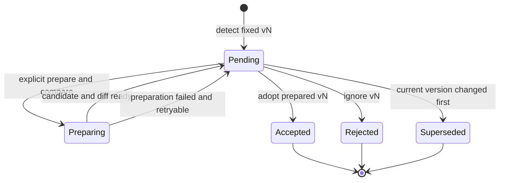
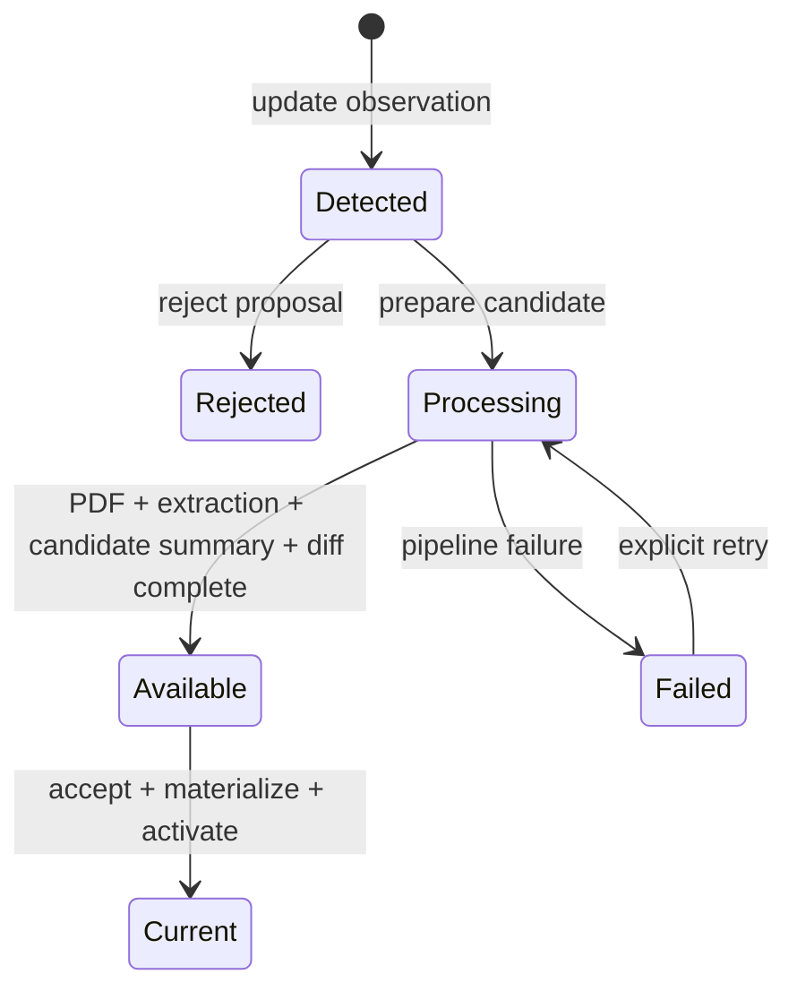

# Implementation Slice 013: arXiv Paper Version 审核闭环

> Status: accepted
> Scope: 只补齐已收录 Paper 的 arXiv 新版本检测、审核、处理与激活；不改变首次导入语义。

## 1. 问题与目标

当前 Paper 工作区会在打开时查询 arXiv 最新版本，并创建
`paper-version-update` Proposal。对于 arXiv 更新，Proposal 只保存
`currentVersion/latestVersion`，审核中心也只显示“打开相关 Paper”。通用审核命令则要求
Proposal 已关联 `candidateVersionId` 和可恢复的 import job。因此通知能够出现，却不能接受、
拒绝或完成更新。

当前检测不是后台任务：只有 `GET /api/papers/:id` 读取 arXiv Paper 工作区时，应用才调用
`PaperSource.resolve(arxivId)`，比较远端 `latestVersion` 与本地 current version。远端失败会被
吞掉以保证 Paper 仍可阅读；列表页、定时器和服务端 scheduler 都不会主动检查。Proposal ID
按 Paper + version 确定，`INSERT OR IGNORE` 避免重复。本 Slice 保留“打开时检查”并增加手动
“检查新版本”，两者都调用 `PaperVersionReview.observe`；暂不实现后台批量检查。未来 scheduler
可以作为复用同一 Interface 的 Adapter，并单独处理频率、限流和失败通知。

本 Slice 要形成完整闭环：

1. 检测到 v4 时，持久化一个固定指向 v4 的候选 Paper Version 和 Proposal；
2. 用户可以显式准备候选版本，并在采用前查看 v3 → v4 的可核验 diff；
3. 准备候选只下载、提取并生成候选 Summary/diff，不改变长期知识或 current version；
4. 用户查看 diff 后可以采用或忽略 v4；
5. 只有采用决定和 Paper manifest 写入全部成功后，v4 才成为 current version；
6. 旧版本、旧 Conversation 和它们的 Evidence 永久保持可追溯；
7. 失败、中断、重试、重复命令和并发检测都不能静默替换或回退当前版本。

## 2. 非目标

- 不自动接受 arXiv 更新；
- 不在仅检测到新版本时自动下载 PDF；候选准备必须由用户显式触发；
- 不提供逐字逐行的 PDF redline；首版提供结构化、带双版本 Evidence 的语义 diff；
- 不在本 Slice 实现 Conversation handoff Artifact 或 Takeaway 自动 `needs-review`；
- 不实现定时后台版本扫描；
- 不让显式重新导入 `...v4` 成为更新既有 Paper 的旁路；
- 不改变 direct-PDF 以 content hash 作为版本身份、接受前必须打开本地候选 PDF 的规则；
- 不同时重构整个 `ImportStore` 或通用 Proposal 模型。

## 3. 核心产品语义

审核卡应明确区分“来源发现”和“内容证据”：

```text
ARXIV VERSION UPDATE
Paper Version v4 可用
当前版本 v3 · 已固定候选 v4 · 尚未下载或替换当前版本

[在 arXiv 查看 v4]  [准备并比较 v4]  [忽略 v4]
```

- “在 arXiv 查看 v4”打开固定版本 URL，例如
  `https://arxiv.org/abs/2401.12345v4`，不能打开裸 ID；
- arXiv 版本存在性已经由 metadata resolve 验证，所以准备不以“已打开来源”为前置条件；
- “准备并比较”表示授权下载、提取和生成候选 Summary/diff，Proposal 仍为 pending；
- 准备完成后，卡片展示 diff 摘要和“采用 v4 / 忽略 v4”；
- 采用后卡片离开待审核队列并切换 current version；
- “忽略 v4”只拒绝 v4；以后检测到 v5 时仍创建新的 Proposal；
- 不再对 Paper Version 更新显示“证据已满足快速确认条件”。`oneClickEligible` 只控制是否
  需要来源打开门槛，不作为用户文案。

## 4. 不变量

1. 在版本更新路径中，`papers.current_version_id` 在候选版本成为
   `processing_status='available'` 前保持不变；本 Slice 不改变首次导入期间 current version
   可处于 processing 的既有语义。
2. `(paper_id, source_type, source_version)` 唯一；同一 Paper 的 arXiv v4 只有一个
   Paper Version。
3. 同一 Paper、同一候选版本最多有一个有效的 `paper-version-update` Proposal。
4. Proposal 接受、ReviewDecision、ImportRequest、JobRun 与候选版本进入 processing
   必须在一个 SQLite transaction 中提交。
5. 远程下载和 Agent 执行绝不位于该 transaction 内。
6. 下载、校验、提取、Summary 或 Markdown 写入失败时，current version 不变。
7. 接受命令按 idempotency key 可重放；重复点击不能创建第二个 job 或 ReviewDecision。
8. 命令始终固定 Proposal 中的 `candidateVersion`，不能把 v4 命令悄悄升级为 v5；若已观察到
   v5，v4 Proposal superseded，任何 v4 accept 都返回 stale。
9. 同一 Paper 同时最多有一个仍在运行的 version-update preparation job，避免完成顺序
   导致版本回退。
10. 显式导入一个已存在 Paper 的更高 arXiv 版本必须进入同一审核流程，不能直接更新
    `current_version_id`。
11. 候选 Summary 和 diff 在采用前不进入 curated retrieval，也不写成 active Markdown 知识。
12. 已存在 Conversation 的 Context Snapshot 不因版本采用而改变。
13. 旧 Paper Version、PDF Artifact、Extraction、Summary、Evidence 和 Conversation 不被覆盖或删除。
14. 确定性 material diff ready 是采用门槛；Agent change digest 是 best-effort，失败不阻塞采用。
15. v3 Conversation 在 v4 激活后仍可写，但所有新 turn 继续使用冻结的 v3 Context Snapshot。

## 5. 状态模型

### 5.1 Proposal



`review_status='superseded'` 表示系统确认该 Proposal 已不再适用，不伪造用户拒绝决定。
如果暂不扩展状态约束，可在首个实现中使用 `archived_at` 隐藏失效 Proposal，同时在
Proposal payload 记录 `archiveReason='current-version-changed'`；正式实现优先增加显式状态。

### 5.2 Candidate Paper Version



`accepted_at` 记录用户最终采用候选版本的时间，不记录准备授权。`Available` 与 `Current` 是
两个事实：Available 表示候选 PDF、Extraction、candidate Summary 和 diff 已准备好；Current
表示 ReviewDecision 与 active Markdown 已提交并成为默认阅读版本。

## 6. 持久化设计

### 6.1 检测阶段

在一个 transaction 中：

1. 读取 Paper 当前版本与 arXiv identity；
2. 若 `latestVersion <= currentVersion`，返回 `null`；
3. `INSERT OR IGNORE` 候选 `paper_versions`：
   - `id = paper-version:{paperId}:arxiv:v{latestVersion}`；
   - `source_type = arxiv`；
   - `source_version = v{latestVersion}`；
   - `source_url = https://arxiv.org/abs/{arxivId}v{latestVersion}`；
   - `processing_status = detected`；
   - `pdf_artifact_id = NULL`；
   - `accepted_at = NULL`。
4. 创建或复用 Proposal：

```json
{
  "contractVersion": "paper-version-update.v1",
  "sourceType": "arxiv",
  "arxivId": "2401.12345",
  "currentVersionId": "paper-version:...:arxiv:v3",
  "currentVersion": 3,
  "candidateVersionId": "paper-version:...:arxiv:v4",
  "candidateVersion": 4,
  "sourceUrl": "https://arxiv.org/abs/2401.12345v4",
  "detectedAt": "..."
}
```

不要在每次打开 Paper 时刷新 `detectedAt` 或 Proposal payload；第一次观察形成审核快照。

### 6.2 候选准备阶段

准备 transaction 必须：

1. 检查 Proposal 仍为 pending；
2. 检查 candidate 属于同一 Paper，且状态为 detected 或 failed；
3. 检查 `papers.current_version_id === payload.currentVersionId`；否则把 Proposal 标为
   superseded 并返回 `paper-version-proposal-stale`；
4. 检查该 Paper 没有其他 active version-update job；否则返回
   `paper-version-update-in-progress`；
5. 创建 resolved ImportRequest，其 `frozen_input_json` 固定：

```json
{
  "versionId": "paper-version:...:arxiv:v4",
  "arxivId": "2401.12345",
  "version": 4,
  "sourceUrl": "https://arxiv.org/abs/2401.12345v4",
  "proposalId": "proposal:paper-version-update:...:v4"
}
```

6. 创建 running `paper-import` JobRun；
7. 将 candidate 设为 processing，但不写 `accepted_at`；
8. Proposal 保持 pending，并在 payload 或独立 preparation record 中关联 job；
9. 不插入 ReviewDecision；
10. 返回 `ImportExecution`，transaction 提交后由既有 pipeline 执行。

若 `codexRunner` 或 `paperSource.fetchPdf` 不可用，路由必须在调用准备命令前返回
`503 import-runner-unavailable`，不得创建 preparation job。

准备成功后：

- Paper Version 进入 available，但 `papers.current_version_id` 保持旧版本；
- Summary 以 `status='candidate'` 保存结构化结果与可恢复 Artifact，不进入 curated projection；
- version diff 进入 ready；
- Proposal 仍为 pending，审核卡变为可采用状态。

### 6.3 接受阶段

接受 transaction 必须：

1. 检查 Proposal pending、candidate available、material diff ready；
2. 检查 current version 仍等于 Proposal 的 `currentVersionId`；
3. 插入 immutable accept ReviewDecision；
4. 将旧版本 Summary 从 active 改为 superseded，将 candidate Summary 改为 active；
5. 将 candidate 写入 `accepted_at`，Proposal 设为 accepted；
6. reserve Paper manifest KnowledgeWriteRequest 和 curated projection outbox；
7. KWR metadata commit 时更新 `papers.current_version_id`；
8. 任何冲突使 Proposal 保持 pending，不产生 accept ReviewDecision。

### 6.4 拒绝阶段

在一个 transaction 中插入 reject ReviewDecision、把 Proposal 设为 rejected，并把仍为
detected、failed 或 available-but-not-current 的 candidate 设为 rejected。已准备的 PDF、Extraction、
candidate Summary 和 diff 作为 historical/audit Artifact 保留，但不进入 active retrieval。

### 6.5 完成与激活

沿用既有 KnowledgeWriteRequest 和恢复机制。最终 metadata commit
只有在以下条件全部满足时更新 `papers.current_version_id`：

- candidate 的 Proposal 已 accepted；
- candidate 为 available；
- current version 仍等于 Proposal 快照中的 `currentVersionId`；
- 不存在已接受的更高 arXiv candidate 已成为 current。

若激活前 current version 已改变，本次产物仍保留为 available historical version，但不得回退
current；记录可诊断事件 `paper-version-activation-skipped`。

### 6.6 Version Diff

新增 version-diff 记录，唯一键为 `(before_version_id, after_version_id, contract_version)`。
Diff 不是简单比较 Summary 文本，而是两层结果：

1. **确定性 material diff**：版本号、页数、提取文本 hash、页面/段落对齐后的新增、删除与修改；
2. **Agent change digest**：方法、实验、数据、结果、结论、限制和引用变化的结构化摘要。

确定性 material diff 失败时 candidate 不可采用；Agent change digest 失败时保留 material diff，
显示稳定错误和重试入口，但允许用户依据 material diff 与原文采用候选版本。

每条语义变化必须同时包含 before/after Evidence；纯新增或纯删除允许一侧为空，但另一侧必须
指向固定 Paper Version 的 Evidence Anchor。建议 contract：

```ts
type PaperVersionDiff = {
  id: string;
  beforeVersionId: string;
  afterVersionId: string;
  status: "running" | "ready" | "failed";
  material: {
    beforePageCount: number;
    afterPageCount: number;
    changedRegions: number;
  };
  significance: "minor" | "moderate" | "major" | "unknown";
  changes: Array<{
    category: "method" | "experiment" | "result" | "conclusion" | "limitation" | "citation" | "other";
    summary: string;
    beforeEvidence: EvidenceRef[];
    afterEvidence: EvidenceRef[];
  }>;
};
```

审核卡先显示 significance、变化数量和分类；展开后逐条展示双版本 Evidence，并允许分别打开
v3/v4 固定页。Diff Artifact 不进入全局知识检索，但可以作为版本后继 Conversation 的显式来源。

## 7. 深 Module 与 Interface

新增 `PaperVersionReview` Module，把版本审核的事务、不变量、幂等和状态转换集中在一个
实现中。SQLite 是 local-substitutable 依赖，测试使用真实临时 SQLite；不为数据库增加公开
Adapter。arXiv 是 true external 依赖，继续由现有 `PaperSource` seam 的生产与测试 Adapter
提供，Module 不直接进行网络 I/O。

建议 Interface：

```ts
type PaperVersionObservation = {
  paperId: string;
  arxivId: string;
  latestVersion: number;
  observedAt: string;
};

type VersionReviewCommand = {
  proposalId: string;
  idempotencyKey: string;
  action: "prepare" | "accept" | "reject";
};

class PaperVersionReview {
  observe(input: PaperVersionObservation): VersionProposalView | null;
  source(proposalId: string): VersionCandidateSource | null;
  act(command: VersionReviewCommand): VersionReviewResult;
}
```

Interface 隐藏 candidate row、ImportRequest、JobRun 和 ReviewDecision 的创建顺序。调用方只需：

- Paper GET 在 resolve 成功后调用 `observe`；
- open-source 路由调用 `source`；
- prepare/decisions 路由调用 `act`，若结果带 execution 则启动现有 pipeline。

direct-PDF 也应逐步迁入同一 Module，但不是 arXiv 闭环上线的前置条件。第一步可以让 Module
同时理解两类 payload，避免继续在通用 `decideProposal` 中增加 source-type 分支。

## 8. HTTP 契约

沿用现有路由，避免增加浅层接口：

### `POST /api/proposals/:id/open-source`

arXiv candidate 返回：

```json
{
  "kind": "external",
  "url": "https://arxiv.org/abs/2401.12345v4",
  "version": 4
}
```

direct-PDF 保持返回本地 Artifact URL，但统一成：

```json
{
  "kind": "artifact",
  "url": "/api/artifacts/{hash}/pdf#page=1",
  "versionId": "..."
}
```

前端在 `kind=external` 时用 `noopener,noreferrer` 打开新窗口。两类打开动作都记录
`source_open_events`，但只有 direct-PDF 将打开事件作为接受门槛。

### `POST /api/proposals/:id/decisions`

- accept 成功：`201`，返回 accepted decision 与 activation result；
- reject 成功：`201`；
- idempotent replay：返回原结果，不创建新 job；
- `409 paper-version-diff-not-ready`；
- `409 paper-version-proposal-stale`；
- `409 paper-version-update-in-progress`；
- `409 paper-version-candidate-missing`；
- `503 import-runner-unavailable`。

### `POST /api/proposals/:id/prepare`

- 首次成功 reserve candidate pipeline：`202`，返回 processing job；
- 已 ready：`200`，返回已有 diff；
- 相同 idempotency key 重放同一 job；
- active job 存在时返回其状态，不创建第二个 job。

## 9. 前端行为

审核中心对 `paper-version-update` 统一渲染专用卡片，不复用 Takeaway 的“证据快速确认”文案。

- arXiv：查看来源、准备并比较、忽略；准备完成后显示采用；查看不是准备前置条件；
- direct-PDF：打开候选 PDF、确认采用、忽略；确认按钮继续以 source-open 为门槛；
- busy 时禁用三个按钮，防止同一卡片重复提交；
- prepare 后显示“正在准备 v4 对比，当前仍为 v3”；
- material diff ready 后允许采用；Agent digest ready 时展示语义变化，失败时显示重试入口；
- accept 后刷新 proposals、papers 和当前 workspace；
- processing/failed 状态在 Paper 页面展示，失败走既有 retry，不重新生成 Proposal；
- 错误文案按稳定 code 映射，不再把所有失败折叠成“候选版本尚未通过来源核验”。

Paper 工作区的 `updateProposal` 与全局 `/api/proposals` 必须来自同一持久化 Proposal，不能产生
只存在于响应中的临时候选。

### 9.1 Conversation 版本语义

Conversation 继续遵守 frozen Context Snapshot：

- 已有 v3 Conversation 永远使用 v3 PDF、v3 Extraction、v3 Summary 和当时固定的知识语料；
- 采用 v4 不改写旧 Conversation，也不让后续 turn 静默混入 v4；
- 新建独立 Conversation 默认使用 current v4；
- 打开旧 Conversation 时显示“此讨论基于 v3；当前 Paper 为 v4”；
- 用户可选择“继续讨论 v3”或“基于 v4 延续讨论”。

“基于 v4 延续讨论”创建一个 successor Conversation，固定 v4 Context Snapshot，并附加
v3 → v4 Version Diff；用户可以通过 lineage 只读下钻父 Conversation。

现有 continuation 只有 lineage 和 Context Diff，新 Conversation 的 chat history 查询只读取自身
messages；不能假设 `continuedFrom` 已经携带了父讨论内容。第一阶段继续使用现有 successor
能力并附加 Version Diff；parent-conversation handoff Artifact 拆到后续 Slice。

当用户在 v4 successor 中询问“新版本是否改变我们之前的判断”时，Agent 获得 version diff 和
v4 Evidence；回答中的每条版本性判断必须区分 v3/v4 source ID。自动带入父讨论摘要需要后续的
handoff Artifact，本 Slice 不假设 Agent 已读过父 Conversation。

从 v3 Chat 已确认的 Takeaway 不自动改写或失效；它们继续保留 v3 provenance。根据 version diff
命中 Evidence Anchor 并创建 `needs-review` Proposal 的自动复核能力拆到后续 Slice；本 Slice
只保证版本 provenance 不丢失、不把 v3 Evidence 伪装成 v4 Evidence。

### 9.2 旧版本与 active retrieval

采用 v4 是移动 `papers.current_version_id`，不是覆盖 v3。以下内容全部保留：

- v3 Paper Version 与 PDF Artifact；
- v3 Extraction、Document Elements 和 Evidence Anchors；
- v3 Summary Revision 与 Markdown；
- 基于 v3 的 Context Snapshots、Conversation、Message 和 Review audit。

激活 v4 时，将 v3 Summary 从 `active` 改为 `superseded`，因此默认 Paper 页面、入口检索和新
Conversation 只使用 v4；按 ID 读取 v3 Summary 和旧 Conversation 仍然有效。当前实现会让不同
Paper Version 的 Summary 同时保持 active，可能使 curated projection 同时检索到新旧 Summary；
本 Slice 必须修复这一点，并在 rebuild query 中额外约束
`summary_revisions.paper_version_id = papers.current_version_id` 作为纵深防线。

Paper 页面增加 Version History：每个版本显示 detected/available/current/rejected、Summary、
Diff 和关联 Conversation 数量。历史版本不可被普通“删除”操作移除；若未来支持 purge，必须走
独立的引用完整性检查和显式破坏性确认。

## 10. 显式导入的防旁路规则

`POST /api/imports` 收到显式 v4 时：

- 若 Paper 不存在：保持首次导入语义，直接导入并将 v4 作为 current；
- 若 Paper 已存在且 v4 等于 current：返回现有 Paper/版本，不创建新 job；
- 若 Paper 已存在且 v4 高于 current：调用 `PaperVersionReview.observe` 并返回 Proposal，
  不更新 current、不下载；
- 若 v4 低于 current：作为 historical version 导入不属于本 Slice；首版返回
  `409 historical-version-import-unsupported`，不能回退 current。

### 10.1 Version metadata

候选检测与准备保存该版本自己的 metadata snapshot。采用新版本时：

- current Paper 展示 metadata 切换到新版本 snapshot；
- Paper ID 和 arXiv External Identity 不变；
- 旧标题若发生变化，作为 Alias 保留；
- 旧版本仍显示其原始 title、authors、year；
- 不因标题或作者顺序变化创建第二个 Paper。

## 11. 并发、幂等与恢复

- Proposal ID 与 candidate version ID 都是确定性的；重复 Paper GET 只读回复用已有记录；
- ReviewDecision 的 idempotency key 继续全局唯一，重放返回第一次结果；
- accept transaction 使用条件更新确保只有 pending Proposal 能获胜；
- preparation crash 后，既有 interrupted-job recovery 暴露 retry；Proposal 保持 pending，不生成第二个 job；
- accept 后若 KWR 中断，Proposal/ReviewDecision 保持 accepted，由既有 KWR recovery 完成激活；
- retry 复用 frozen arXiv ID、version、source URL 和 candidate version ID；
- v5 在 v4 pending 时出现：把 v4 Proposal 标为 superseded，保留记录，只显示 v5；
- v5 在 v4 processing 时出现：v4 preparation 可以完成，但 candidate 不得激活；v4 转为
  historical candidate，v5 成为唯一可审核 Proposal；
- v5 在 v4 available-but-not-current 时出现：supersede v4 Proposal，保留 v4 PDF、Diff 和 Summary；
- v5 在 v4 current 后出现：正常创建 v5 Proposal；
- v4 完成后再打开 Paper 时，任何仍以 v3 为 current snapshot 的 Proposal 都自动 supersede。

## 12. 迁移与兼容

新增 migration 负责：

1. 如采用显式 `superseded`，重建 proposals 约束或补充应用级状态契约；
2. 不为旧 arXiv Proposal 猜测 candidate；它们只能从明确的 `latestVersion` 和 Paper arXiv
   identity 确定性补齐；
3. 对 pending 的旧 Proposal 创建 detected Paper Version，并升级 payload 为 v1 contract；
4. 若 Paper identity 或版本字段不完整，将 Proposal 归档并记录
   `archiveReason='legacy-version-proposal-invalid'`，不静默接受或删除；
5. direct-PDF payload 保持兼容。

迁移必须幂等，并使用真实临时 SQLite fixture 覆盖升级前后的重启。

## 13. 验证矩阵

### Store / HTTP integration

1. v3 Paper 检测到 v4：只创建 detected candidate 与一个 pending Proposal，不下载；
2. 重复打开 Paper：不刷新快照、不重复创建；
3. 查看 arXiv candidate：返回固定 v4 URL并记录 open event；
4. 不查看也可准备 arXiv v4；direct-PDF 未查看仍不可接受；
5. prepare 原子创建 import/job，但不创建 decision，current 仍为 v3；
6. preparation 成功后 v4 available、diff ready、candidate Summary 不进入检索；
7. accept 原子创建 decision并激活 v4，manifest 与 active Summary 指向 v4；
8. 下载、PDF 校验、Summary、diff、KWR 各阶段失败时 current 保持 v3；
9. interrupted 后 retry 复用同一 candidate，不创建第二个 preparation job；
10. reject 后 v4 保留为 rejected，重新打开不再通知 v4；
11. v5 后续出现会产生新 Proposal；
12. stale proposal 不能接受；
13. 并发双击 prepare/accept 分别只有一个 job/decision；
14. v4 processing 时不能准备 v5；
15. 显式导入 v4 对既有 Paper 不绕过审核；
16. 无 runner 时 prepare 返回 503 且 Proposal 仍 pending；
17. material diff ready 后可以采用；Agent digest failed 不阻塞采用；
18. v4 激活后 curated projection 只含 v4 Summary；
19. v3 Conversation 后续 turn 仍只使用 v3 Evidence；
20. v4 successor 获得 version diff；parent handoff 留给后续 Slice；
21. title/authors 变化后 current metadata 更新，旧 title 成为 Alias，旧版本 metadata 不变；
22. v5 出现时 v4 不再可激活，但其已准备 Artifact 全部保留。

### Browser journey

使用真实 Playwright 完成：

1. 打开 v3 Paper，出现 v4 审核通知；
2. 进入审核中心，查看固定 v4 arXiv 页面；
3. 准备对比，Paper 显示 v4 processing / 当前 v3；
4. 完成后查看带双版本 Evidence 的 diff，再采用 v4；
5. Paper 显示 current v4 和 v4 Summary，Version History 仍可打开 v3；
6. 打开旧 Chat，验证仍可继续写、只使用 v3 Evidence，并创建带 Version Diff 的 v4 successor；
7. 另一 fixture 上忽略 v4，验证队列清除且重开 Paper 不复现。

### Repository verification

完成实现后执行：

```bash
npm test
npm run typecheck
npm run build
git diff --check
```

并针对 storage change 运行 snapshot verification，再 restore 到全新的临时 data root。

## 14. 实施顺序

1. 增加 migration、payload contract 与 `PaperVersionReview` Module 的 store-level tests；
2. 实现 `observe/source/act` 与 candidate preparation，接入现有 import execution；
3. 实现确定性 material diff、带 Evidence 的 Agent change digest；
4. 修复 Summary active/superseded、激活守卫、retry 与显式导入防旁路；
5. 接入 HTTP error contract；
6. 实现专用审核卡、diff inspector、Version History 与 Paper processing 状态；
7. 实现旧 Chat 版本提示和带 Version Diff 的 version-aware successor；
8. 补 migration、integration、Playwright、snapshot/restore 验证；
9. 更新 `data-model.md`、`architecture.md`、`frontend-information-architecture.md` 与相关 ADR。

每一步保持可单独验证；在 store/HTTP 闭环完成前，不先上线可点击但无法恢复的 UI。

## 15. 后续 Slice

以下能力明确不阻塞本 Slice 上线：

1. 定时后台批量检测 arXiv 更新，包括频率、限流、退避和通知策略；
2. parent-conversation handoff Artifact，让 successor 获得有引用的父讨论摘要；
3. 根据 Version Diff 与 Evidence Anchor 命中关系，为受影响 Takeaway 自动创建
   `needs-review` Proposal。
